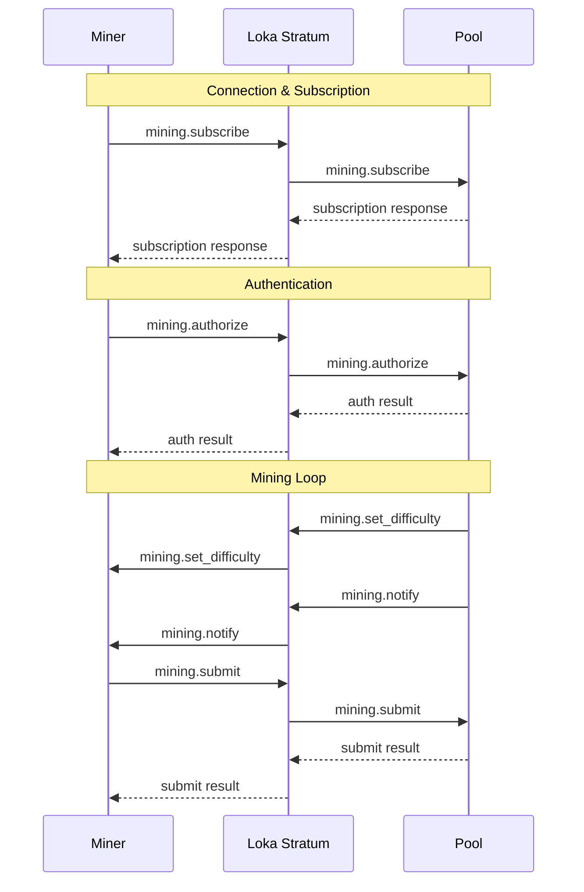
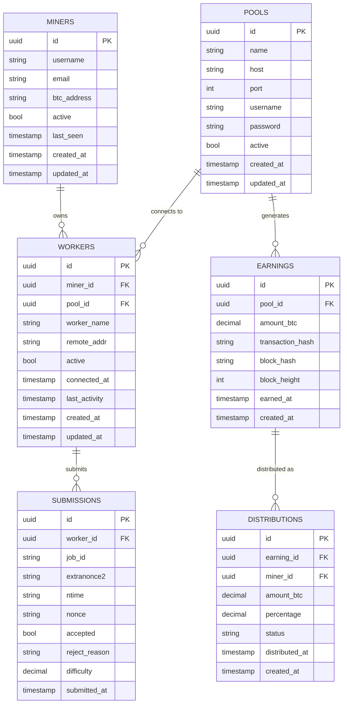

# Loka Stratum API Documentation

Comprehensive API documentation for Loka Stratum Bitcoin Mining Proxy, covering Stratum V1 protocol implementation, HTTP endpoints, metrics, and database schema.

## Table of Contents

- [Stratum V1 Protocol](#stratum-v1-protocol)
- [HTTP Endpoints](#http-endpoints)
- [Metrics API](#metrics-api)
- [Health Check API](#health-check-api)
- [WebSocket API](#websocket-api)
- [Database Schema](#database-schema)
- [Error Codes](#error-codes)
- [Authentication](#authentication)
- [Rate Limiting](#rate-limiting)
- [Client Libraries](#client-libraries)

## Stratum V1 Protocol

The Loka Stratum proxy implements the Bitcoin Stratum V1 mining protocol with full compliance and extensions.

### Protocol Overview

**Connection Model**: TCP-based JSON-RPC over raw sockets
**Port**: 3333 (default, configurable)
**Message Format**: JSON-RPC 2.0 with Stratum extensions

### Message Flow



### Stratum Methods

#### mining.subscribe

Establishes mining session and subscribes to work notifications.

**Client Request:**
```json
{
  "id": 1,
  "method": "mining.subscribe",
  "params": [
    "cpuminer/2.5.0",  // User agent (optional)
    "session_id"       // Previous session ID (optional)
  ]
}
```

**Server Response:**
```json
{
  "id": 1,
  "result": [
    [
      ["mining.set_difficulty", "subscription_id_1"],
      ["mining.notify", "subscription_id_2"]
    ],
    "extranonce1",    // 4 bytes hex
    4                 // extranonce2_size
  ],
  "error": null
}
```

**Parameters:**
- `user_agent` (string, optional): Client identification
- `session_id` (string, optional): Resume previous session

**Response Fields:**
- `subscriptions`: Array of notification subscriptions
- `extranonce1`: Server-assigned extranonce1 value
- `extranonce2_size`: Size of extranonce2 in bytes

#### mining.authorize

Authenticates worker with username and password.

**Client Request:**
```json
{
  "id": 2,
  "method": "mining.authorize",
  "params": [
    "username.worker1",  // Worker identifier
    "password"           // Worker password (optional)
  ]
}
```

**Server Response:**
```json
{
  "id": 2,
  "result": true,
  "error": null
}
```

**Parameters:**
- `username`: Worker username (format: `pool_user.worker_name`)
- `password`: Worker password (often unused)

**Authentication States:**
- `unauthenticated`: Initial state, only subscribe allowed
- `authenticated`: Full access to mining operations
- `failed`: Authentication failed, connection may be terminated

#### mining.submit

Submits mining share to pool.

**Client Request:**
```json
{
  "id": 3,
  "method": "mining.submit",
  "params": [
    "username.worker1",     // Worker name
    "job_id",              // Job ID from mining.notify
    "extranonce2",         // Hex string
    "time",                // Hex string (4 bytes)
    "nonce"                // Hex string (4 bytes)
  ]
}
```

**Server Response (Accept):**
```json
{
  "id": 3,
  "result": true,
  "error": null
}
```

**Server Response (Reject):**
```json
{
  "id": 3,
  "result": false,
  "error": [23, "Invalid nonce", null]
}
```

**Parameters:**
- `worker_name`: Must match authorized worker
- `job_id`: Current job identifier
- `extranonce2`: Miner-chosen nonce extension
- `time`: Block timestamp (must be within acceptable range)
- `nonce`: 32-bit nonce value

#### mining.set_difficulty

Server notification to set new mining difficulty.

**Server Notification:**
```json
{
  "id": null,
  "method": "mining.set_difficulty",
  "params": [16384]  // New difficulty
}
```

**Parameters:**
- `difficulty`: New difficulty target (integer)

#### mining.notify

Server notification with new mining work.

**Server Notification:**
```json
{
  "id": null,
  "method": "mining.notify",
  "params": [
    "job_id",                    // Job ID
    "prev_hash",                 // Previous block hash
    "coinb1",                    // Coinbase part 1
    "coinb2",                    // Coinbase part 2
    ["merkle_branch"],           // Merkle branch hashes
    "version",                   // Block version
    "nbits",                     // Difficulty bits
    "ntime",                     // Current timestamp
    true                         // Clean jobs flag
  ]
}
```

**Parameters:**
- `job_id`: Unique job identifier
- `prevhash`: SHA256 hash of previous block (hex, big-endian)
- `coinb1`: First part of coinbase transaction (hex)
- `coinb2`: Second part of coinbase transaction (hex)
- `merkle_branch`: Array of merkle tree branch hashes
- `version`: Block version (hex, 4 bytes)
- `nbits`: Encoded difficulty target (hex, 4 bytes)
- `ntime`: Block timestamp (hex, 4 bytes)
- `clean_jobs`: If true, discard current jobs

### Protocol Extensions

#### mining.get_version

Request server version information.

**Client Request:**
```json
{
  "id": 4,
  "method": "mining.get_version",
  "params": []
}
```

**Server Response:**
```json
{
  "id": 4,
  "result": "Loka Stratum/2.1.0",
  "error": null
}
```

#### mining.ping

Keep-alive mechanism.

**Client/Server Request:**
```json
{
  "id": 5,
  "method": "mining.ping",
  "params": []
}
```

**Response:**
```json
{
  "id": 5,
  "result": "pong",
  "error": null
}
```

### Error Handling

**Standard Error Format:**
```json
{
  "id": 1,
  "result": null,
  "error": [error_code, "error_message", additional_data]
}
```

**Common Error Codes:**
- `20` - Other/Unknown error
- `21` - Job not found
- `22` - Duplicate share
- `23` - Low difficulty share
- `24` - Unauthorized worker
- `25` - Not subscribed

## HTTP Endpoints

### Health and Status

#### GET /health

Returns comprehensive health information.

**Request:**
```bash
curl http://localhost:9090/health
```

**Response:**
```json
{
  "status": "healthy",
  "uptime": "2d 4h 23m 15s",
  "version": "2.1.0",
  "build": "a1b2c3d",
  "timestamp": "2024-01-15T10:30:45Z",
  "connections": {
    "active": 234,
    "total": 1523,
    "max": 1000,
    "utilization": 0.234
  },
  "services": {
    "database": "healthy",
    "pool_connection": "healthy",
    "metrics": "healthy",
    "monitoring": "healthy"
  },
  "performance": {
    "memory_usage_bytes": 128456789,
    "memory_usage_mb": 122.5,
    "cpu_usage_percent": 15.2,
    "threads_active": 12,
    "threads_total": 16
  },
  "pools": [
    {
      "name": "main_pool",
      "host": "130.211.20.161:9200",
      "status": "connected",
      "latency_ms": 45.2,
      "last_job": "2024-01-15T10:30:40Z"
    }
  ]
}
```

**Response Codes:**
- `200 OK` - Service is healthy
- `503 Service Unavailable` - Service is unhealthy

#### GET /ready

Kubernetes readiness probe endpoint.

**Request:**
```bash
curl http://localhost:9090/ready
```

**Response:**
```json
{
  "ready": true,
  "services": {
    "database": "ready",
    "pool_connection": "ready"
  }
}
```

#### GET /live

Kubernetes liveness probe endpoint.

**Request:**
```bash
curl http://localhost:9090/live
```

**Response:**
```json
{
  "alive": true,
  "pid": 1234,
  "timestamp": "2024-01-15T10:30:45Z"
}
```

### Configuration

#### GET /config

Returns current configuration (sanitized).

**Request:**
```bash
curl http://localhost:9090/config
```

**Response:**
```json
{
  "server": {
    "port": 3333,
    "bind_address": "0.0.0.0",
    "max_connections": 1000
  },
  "pool": {
    "name": "main_pool",
    "host": "130.211.20.161",
    "port": 9200,
    "username": "mining_user"
  },
  "limiter": {
    "connections": 1000,
    "jobs_ttl": "600s",
    "submissions_ttl": "172800s"
  },
  "features": {
    "metrics_enabled": true,
    "monitoring_enabled": true,
    "auth_required": true
  }
}
```

#### POST /config/reload

Reloads configuration from file (requires admin authentication).

**Request:**
```bash
curl -X POST \
  -H "Authorization: Bearer $ADMIN_TOKEN" \
  http://localhost:9090/config/reload
```

**Response:**
```json
{
  "status": "success",
  "message": "Configuration reloaded successfully",
  "timestamp": "2024-01-15T10:30:45Z"
}
```

### Statistics

#### GET /stats

Returns comprehensive statistics.

**Request:**
```bash
curl http://localhost:9090/stats
```

**Response:**
```json
{
  "connections": {
    "current": 234,
    "peak": 567,
    "total": 1523,
    "rate": {
      "current": 2.5,
      "peak": 45.2
    },
    "by_pool": {
      "main_pool": 234
    }
  },
  "mining": {
    "shares": {
      "submitted": 152340,
      "accepted": 149832,
      "rejected": 2508,
      "acceptance_rate": 98.35
    },
    "jobs": {
      "distributed": 45670,
      "current_difficulty": 16384,
      "average_time": 8.2
    },
    "hashrate": {
      "estimated": "150.5 TH/s",
      "workers": 234
    }
  },
  "performance": {
    "response_time": {
      "mean": 12.5,
      "p95": 45.2,
      "p99": 89.7
    },
    "throughput": {
      "messages_per_second": 1250.5,
      "bytes_per_second": 45678
    }
  },
  "errors": {
    "total": 45,
    "rate": 0.03,
    "by_type": {
      "protocol_error": 12,
      "auth_failed": 8,
      "pool_error": 15,
      "connection_error": 10
    }
  }
}
```

#### GET /stats/workers

Returns worker-specific statistics.

**Request:**
```bash
curl http://localhost:9090/stats/workers
```

**Response:**
```json
{
  "total_workers": 234,
  "active_workers": 230,
  "workers": [
    {
      "id": "user.worker1",
      "pool": "main_pool",
      "connected_at": "2024-01-15T08:15:30Z",
      "last_activity": "2024-01-15T10:30:40Z",
      "shares": {
        "submitted": 145,
        "accepted": 142,
        "rejected": 3,
        "acceptance_rate": 97.93
      },
      "hashrate": "650 GH/s",
      "difficulty": 16384,
      "status": "active"
    }
  ]
}
```

## Metrics API

### GET /metrics/prometheus

Prometheus-formatted metrics endpoint.

**Request:**
```bash
curl http://localhost:9090/metrics/prometheus
```

**Response:**
```
# HELP loka_stratum_connections_total Total number of connections
# TYPE loka_stratum_connections_total counter
loka_stratum_connections_total{pool_name="main_pool"} 1523

# HELP loka_stratum_connections_active Currently active connections
# TYPE loka_stratum_connections_active gauge
loka_stratum_connections_active{pool_name="main_pool"} 234

# HELP loka_stratum_shares_submitted_total Total shares submitted
# TYPE loka_stratum_shares_submitted_total counter
loka_stratum_shares_submitted_total{worker_name="user.worker1",pool_name="main_pool"} 145

# HELP loka_stratum_response_time_seconds Response time histogram
# TYPE loka_stratum_response_time_seconds histogram
loka_stratum_response_time_seconds_bucket{method="mining.submit",le="0.001"} 1250
loka_stratum_response_time_seconds_bucket{method="mining.submit",le="0.005"} 2340
loka_stratum_response_time_seconds_bucket{method="mining.submit",le="0.01"} 2450
loka_stratum_response_time_seconds_bucket{method="mining.submit",le="+Inf"} 2500
loka_stratum_response_time_seconds_sum{method="mining.submit"} 12.5
loka_stratum_response_time_seconds_count{method="mining.submit"} 2500
```

### GET /metrics/json

JSON-formatted metrics endpoint.

**Request:**
```bash
curl http://localhost:9090/metrics/json
```

**Response:**
```json
{
  "counters": {
    "loka_stratum_connections_total": {
      "main_pool": 1523
    },
    "loka_stratum_shares_submitted_total": {
      "user.worker1,main_pool": 145,
      "user.worker2,main_pool": 89
    }
  },
  "gauges": {
    "loka_stratum_connections_active": {
      "main_pool": 234
    },
    "loka_stratum_memory_usage_bytes": 128456789
  },
  "histograms": {
    "loka_stratum_response_time_seconds": {
      "mining.submit": {
        "count": 2500,
        "sum": 12.5,
        "buckets": {
          "0.001": 1250,
          "0.005": 2340,
          "0.01": 2450
        }
      }
    }
  }
}
```

### WebSocket /metrics/stream

Real-time metrics streaming via WebSocket.

**Connection:**
```javascript
const ws = new WebSocket('ws://localhost:9090/metrics/stream');

ws.onmessage = function(event) {
  const metrics = JSON.parse(event.data);
  console.log('Real-time metrics:', metrics);
};
```

**Message Format:**
```json
{
  "timestamp": "2024-01-15T10:30:45Z",
  "metrics": {
    "connections_active": 234,
    "shares_per_second": 12.5,
    "response_time_ms": 15.2,
    "memory_usage_mb": 122.5,
    "cpu_percent": 15.2
  }
}
```

### Server-Sent Events /metrics/events

Server-sent events stream for metrics.

**Request:**
```bash
curl -N -H "Accept: text/event-stream" http://localhost:9090/metrics/events
```

**Response:**
```
data: {"timestamp":"2024-01-15T10:30:45Z","connections_active":234,"shares_per_second":12.5}

data: {"timestamp":"2024-01-15T10:30:50Z","connections_active":235,"shares_per_second":13.1}
```

## Health Check API

### Detailed Health Endpoints

#### GET /health/database

Database-specific health check.

**Response:**
```json
{
  "status": "healthy",
  "connection_pool": {
    "active": 8,
    "idle": 12,
    "max": 50
  },
  "query_performance": {
    "avg_response_time_ms": 2.5,
    "slow_queries": 0
  },
  "migrations": {
    "current_version": "20240115_001",
    "pending": 0
  }
}
```

#### GET /health/pool

Mining pool connection health.

**Response:**
```json
{
  "status": "healthy",
  "pools": [
    {
      "name": "main_pool",
      "host": "130.211.20.161:9200",
      "connected": true,
      "last_message": "2024-01-15T10:30:40Z",
      "latency_ms": 45.2,
      "jobs_received": 1234,
      "shares_submitted": 5678
    }
  ]
}
```

#### GET /health/system

System resource health.

**Response:**
```json
{
  "status": "healthy",
  "resources": {
    "cpu": {
      "usage_percent": 15.2,
      "cores": 8,
      "load_avg": [1.2, 1.1, 0.9]
    },
    "memory": {
      "usage_percent": 65.4,
      "used_mb": 1638,
      "total_mb": 2048,
      "available_mb": 410
    },
    "disk": {
      "usage_percent": 45.2,
      "free_gb": 25.8,
      "total_gb": 47.1
    },
    "network": {
      "interfaces": [
        {
          "name": "eth0",
          "bytes_sent": 1234567890,
          "bytes_received": 9876543210,
          "errors": 0
        }
      ]
    }
  }
}
```

## WebSocket API

### Real-time Connection Events

#### WebSocket /events/connections

**Connection:**
```javascript
const ws = new WebSocket('ws://localhost:9090/events/connections');
```

**Event Types:**
```json
{
  "type": "connection_established",
  "timestamp": "2024-01-15T10:30:45Z",
  "data": {
    "connection_id": "conn_123",
    "remote_addr": "192.168.1.100",
    "pool": "main_pool"
  }
}

{
  "type": "worker_authenticated",
  "timestamp": "2024-01-15T10:30:47Z",
  "data": {
    "connection_id": "conn_123",
    "worker_name": "user.worker1",
    "pool": "main_pool"
  }
}

{
  "type": "share_submitted",
  "timestamp": "2024-01-15T10:30:50Z",
  "data": {
    "worker_name": "user.worker1",
    "job_id": "job_456",
    "result": "accepted",
    "difficulty": 16384
  }
}
```

### Administrative WebSocket

#### WebSocket /admin/console

Administrative console for real-time management.

**Authentication Required:**
```javascript
const ws = new WebSocket('ws://localhost:9090/admin/console', [], {
  headers: {
    'Authorization': 'Bearer ' + adminToken
  }
});
```

**Commands:**
```json
{
  "command": "list_connections",
  "params": {}
}

{
  "command": "disconnect_worker",
  "params": {
    "worker_name": "user.worker1"
  }
}

{
  "command": "update_pool_config",
  "params": {
    "pool_name": "main_pool",
    "config": {
      "host": "new-pool.example.com",
      "port": 4444
    }
  }
}
```

## Database Schema

### Entity Relationship Diagram



### Table Schemas

#### pools

```sql
CREATE TABLE pools (
    id UUID PRIMARY KEY DEFAULT gen_random_uuid(),
    name VARCHAR(255) NOT NULL UNIQUE,
    host INET NOT NULL,
    port INTEGER NOT NULL CHECK (port > 0 AND port <= 65535),
    username VARCHAR(255) NOT NULL,
    password VARCHAR(255),
    active BOOLEAN NOT NULL DEFAULT true,
    metadata JSONB DEFAULT '{}',
    created_at TIMESTAMP WITH TIME ZONE DEFAULT NOW(),
    updated_at TIMESTAMP WITH TIME ZONE DEFAULT NOW()
);

-- Indexes
CREATE INDEX idx_pools_name ON pools(name);
CREATE INDEX idx_pools_active ON pools(active);
CREATE INDEX idx_pools_host_port ON pools(host, port);
```

#### miners

```sql
CREATE TABLE miners (
    id UUID PRIMARY KEY DEFAULT gen_random_uuid(),
    username VARCHAR(255) NOT NULL UNIQUE,
    email VARCHAR(255),
    btc_address VARCHAR(64),
    active BOOLEAN NOT NULL DEFAULT true,
    last_seen TIMESTAMP WITH TIME ZONE,
    settings JSONB DEFAULT '{}',
    created_at TIMESTAMP WITH TIME ZONE DEFAULT NOW(),
    updated_at TIMESTAMP WITH TIME ZONE DEFAULT NOW(),
    
    CONSTRAINT valid_btc_address CHECK (
        btc_address IS NULL OR 
        (LENGTH(btc_address) >= 26 AND LENGTH(btc_address) <= 62)
    )
);

-- Indexes
CREATE UNIQUE INDEX idx_miners_username ON miners(username);
CREATE INDEX idx_miners_active ON miners(active);
CREATE INDEX idx_miners_last_seen ON miners(last_seen DESC);
CREATE INDEX idx_miners_btc_address ON miners(btc_address);
```

#### workers

```sql
CREATE TABLE workers (
    id UUID PRIMARY KEY DEFAULT gen_random_uuid(),
    miner_id UUID NOT NULL REFERENCES miners(id) ON DELETE CASCADE,
    pool_id UUID NOT NULL REFERENCES pools(id) ON DELETE CASCADE,
    worker_name VARCHAR(255) NOT NULL,
    remote_addr INET,
    user_agent VARCHAR(255),
    active BOOLEAN NOT NULL DEFAULT false,
    connected_at TIMESTAMP WITH TIME ZONE,
    last_activity TIMESTAMP WITH TIME ZONE,
    disconnect_reason VARCHAR(255),
    session_data JSONB DEFAULT '{}',
    created_at TIMESTAMP WITH TIME ZONE DEFAULT NOW(),
    updated_at TIMESTAMP WITH TIME ZONE DEFAULT NOW(),
    
    UNIQUE(miner_id, pool_id, worker_name)
);

-- Indexes
CREATE INDEX idx_workers_miner_id ON workers(miner_id);
CREATE INDEX idx_workers_pool_id ON workers(pool_id);
CREATE INDEX idx_workers_active ON workers(active);
CREATE INDEX idx_workers_last_activity ON workers(last_activity DESC);
CREATE INDEX idx_workers_worker_name ON workers(worker_name);
```

#### submissions

```sql
CREATE TABLE submissions (
    id UUID PRIMARY KEY DEFAULT gen_random_uuid(),
    worker_id UUID NOT NULL REFERENCES workers(id) ON DELETE CASCADE,
    job_id VARCHAR(64) NOT NULL,
    extranonce2 VARCHAR(16) NOT NULL,
    ntime VARCHAR(8) NOT NULL,
    nonce VARCHAR(8) NOT NULL,
    accepted BOOLEAN NOT NULL,
    reject_reason VARCHAR(255),
    difficulty DECIMAL(20,8) NOT NULL,
    hash_rate BIGINT,
    submitted_at TIMESTAMP WITH TIME ZONE DEFAULT NOW(),
    
    UNIQUE(worker_id, job_id, extranonce2, ntime, nonce)
);

-- Indexes
CREATE INDEX idx_submissions_worker_id ON submissions(worker_id);
CREATE INDEX idx_submissions_submitted_at ON submissions(submitted_at DESC);
CREATE INDEX idx_submissions_accepted ON submissions(accepted);
CREATE INDEX idx_submissions_job_id ON submissions(job_id);

-- Partitioning by month for large datasets
CREATE INDEX idx_submissions_submitted_at_month ON submissions 
    USING BRIN (submitted_at) WITH (pages_per_range = 128);
```

#### earnings

```sql
CREATE TABLE earnings (
    id UUID PRIMARY KEY DEFAULT gen_random_uuid(),
    pool_id UUID NOT NULL REFERENCES pools(id) ON DELETE CASCADE,
    amount_btc DECIMAL(16,8) NOT NULL CHECK (amount_btc > 0),
    transaction_hash VARCHAR(64),
    block_hash VARCHAR(64),
    block_height INTEGER,
    fee_btc DECIMAL(16,8) DEFAULT 0,
    status VARCHAR(50) NOT NULL DEFAULT 'pending',
    earned_at TIMESTAMP WITH TIME ZONE DEFAULT NOW(),
    processed_at TIMESTAMP WITH TIME ZONE,
    created_at TIMESTAMP WITH TIME ZONE DEFAULT NOW(),
    
    CONSTRAINT valid_status CHECK (status IN ('pending', 'confirmed', 'distributed', 'failed'))
);

-- Indexes
CREATE INDEX idx_earnings_pool_id ON earnings(pool_id);
CREATE INDEX idx_earnings_earned_at ON earnings(earned_at DESC);
CREATE INDEX idx_earnings_status ON earnings(status);
CREATE INDEX idx_earnings_block_height ON earnings(block_height DESC);
CREATE UNIQUE INDEX idx_earnings_tx_hash ON earnings(transaction_hash) WHERE transaction_hash IS NOT NULL;
```

#### distributions

```sql
CREATE TABLE distributions (
    id UUID PRIMARY KEY DEFAULT gen_random_uuid(),
    earning_id UUID NOT NULL REFERENCES earnings(id) ON DELETE CASCADE,
    miner_id UUID NOT NULL REFERENCES miners(id) ON DELETE CASCADE,
    amount_btc DECIMAL(16,8) NOT NULL CHECK (amount_btc > 0),
    percentage DECIMAL(5,4) NOT NULL CHECK (percentage > 0 AND percentage <= 1),
    status VARCHAR(50) NOT NULL DEFAULT 'pending',
    transaction_hash VARCHAR(64),
    distributed_at TIMESTAMP WITH TIME ZONE,
    created_at TIMESTAMP WITH TIME ZONE DEFAULT NOW(),
    
    CONSTRAINT valid_status CHECK (status IN ('pending', 'sent', 'confirmed', 'failed'))
);

-- Indexes
CREATE INDEX idx_distributions_earning_id ON distributions(earning_id);
CREATE INDEX idx_distributions_miner_id ON distributions(miner_id);
CREATE INDEX idx_distributions_status ON distributions(status);
CREATE INDEX idx_distributions_distributed_at ON distributions(distributed_at DESC);
```

### Database Queries

#### Common Queries

**Get Active Workers by Pool:**
```sql
SELECT 
    w.worker_name,
    m.username,
    w.connected_at,
    w.last_activity,
    COUNT(s.id) as total_shares,
    COUNT(s.id) FILTER (WHERE s.accepted = true) as accepted_shares
FROM workers w
JOIN miners m ON w.miner_id = m.id
JOIN pools p ON w.pool_id = p.id
LEFT JOIN submissions s ON w.id = s.worker_id 
    AND s.submitted_at > NOW() - INTERVAL '1 hour'
WHERE w.active = true 
    AND p.name = $1
GROUP BY w.id, w.worker_name, m.username, w.connected_at, w.last_activity
ORDER BY w.last_activity DESC;
```

**Get Pool Performance Statistics:**
```sql
SELECT 
    p.name,
    COUNT(DISTINCT w.id) as active_workers,
    COUNT(s.id) as total_shares,
    COUNT(s.id) FILTER (WHERE s.accepted = true) as accepted_shares,
    ROUND(
        COUNT(s.id) FILTER (WHERE s.accepted = true)::numeric / 
        NULLIF(COUNT(s.id), 0) * 100, 2
    ) as acceptance_rate,
    AVG(s.difficulty) as avg_difficulty
FROM pools p
LEFT JOIN workers w ON p.id = w.pool_id AND w.active = true
LEFT JOIN submissions s ON w.id = s.worker_id 
    AND s.submitted_at > NOW() - INTERVAL '1 hour'
WHERE p.active = true
GROUP BY p.id, p.name
ORDER BY active_workers DESC;
```

**Get Miner Earnings Summary:**
```sql
SELECT 
    m.username,
    m.btc_address,
    COUNT(DISTINCT w.id) as active_workers,
    SUM(d.amount_btc) as total_earnings_btc,
    COUNT(d.id) FILTER (WHERE d.status = 'confirmed') as confirmed_payments
FROM miners m
LEFT JOIN workers w ON m.id = w.miner_id AND w.active = true
LEFT JOIN distributions d ON m.id = d.miner_id
WHERE m.active = true
GROUP BY m.id, m.username, m.btc_address
ORDER BY total_earnings_btc DESC NULLS LAST;
```

## Error Codes

### HTTP Error Codes

| Code | Status | Description |
|------|---------|-------------|
| 200 | OK | Request successful |
| 201 | Created | Resource created successfully |
| 204 | No Content | Request successful, no content returned |
| 400 | Bad Request | Invalid request parameters |
| 401 | Unauthorized | Authentication required |
| 403 | Forbidden | Access denied |
| 404 | Not Found | Resource not found |
| 409 | Conflict | Resource conflict (duplicate) |
| 422 | Unprocessable Entity | Validation error |
| 429 | Too Many Requests | Rate limit exceeded |
| 500 | Internal Server Error | Server error |
| 502 | Bad Gateway | Pool connection error |
| 503 | Service Unavailable | Service temporarily unavailable |

### Stratum Error Codes

| Code | Name | Description |
|------|------|-------------|
| 20 | Other/Unknown | General error |
| 21 | Job not found | Submitted job ID not found |
| 22 | Duplicate share | Share already submitted |
| 23 | Low difficulty share | Share below required difficulty |
| 24 | Unauthorized worker | Worker not authenticated |
| 25 | Not subscribed | Client not subscribed to work |

### Custom Application Errors

```json
{
  "error": {
    "code": "POOL_CONNECTION_FAILED",
    "message": "Failed to connect to mining pool",
    "details": {
      "pool_host": "pool.example.com",
      "pool_port": 4444,
      "retry_count": 3,
      "last_error": "Connection timeout"
    }
  }
}
```

**Error Categories:**
- `CONNECTION_*` - Connection-related errors
- `AUTH_*` - Authentication errors
- `PROTOCOL_*` - Stratum protocol errors
- `POOL_*` - Mining pool communication errors
- `DATABASE_*` - Database operation errors
- `CONFIG_*` - Configuration errors
- `VALIDATION_*` - Input validation errors

## Authentication

### API Authentication

#### Bearer Token Authentication

```bash
# Include authentication header
curl -H "Authorization: Bearer $API_TOKEN" \
  http://localhost:9090/admin/stats
```

#### Generate API Token

```bash
# Generate new API token (admin endpoint)
curl -X POST \
  -H "Content-Type: application/json" \
  -d '{"username":"admin","password":"admin_password"}' \
  http://localhost:9090/auth/token

# Response
{
  "token": "eyJ0eXAiOiJKV1QiLCJhbGciOiJIUzI1NiJ9...",
  "expires_at": "2024-01-16T10:30:45Z"
}
```

### Worker Authentication

Worker authentication follows Stratum protocol standards with extensions:

#### Username Formats

- **Standard**: `pool_username.worker_name`
- **Extended**: `pool_username.worker_name_device_info`
- **Legacy**: `pool_username` (single worker)

#### Authentication Flow

1. **Subscribe**: `mining.subscribe` - No auth required
2. **Authorize**: `mining.authorize` - Required before mining
3. **Mining**: All other methods require successful authorization

## Rate Limiting

### Rate Limiting Configuration

```toml
[rate_limiting]
enabled = true
per_ip_limit = 1000      # requests per minute
per_worker_limit = 600   # requests per minute
burst_limit = 100        # burst allowance
window_size = "1m"       # time window

[rate_limiting.endpoints]
"/health" = { limit = 60, window = "1m" }
"/metrics/prometheus" = { limit = 30, window = "1m" }
"/admin/*" = { limit = 100, window = "1m" }
```

### Rate Limit Headers

```bash
curl -I http://localhost:9090/health

HTTP/1.1 200 OK
X-RateLimit-Limit: 60
X-RateLimit-Remaining: 59
X-RateLimit-Reset: 1642249845
X-RateLimit-Window: 60
```

### Rate Limit Responses

**Rate Limited Response:**
```json
{
  "error": "Rate limit exceeded",
  "code": "RATE_LIMIT_EXCEEDED",
  "limit": 60,
  "window": 60,
  "retry_after": 45
}
```

## Client Libraries

### Rust Client Example

```rust
use serde_json::json;
use tokio::net::TcpStream;
use tokio::io::{AsyncReadExt, AsyncWriteExt};

pub struct StratumClient {
    stream: TcpStream,
    next_id: u64,
}

impl StratumClient {
    pub async fn connect(host: &str, port: u16) -> Result<Self, Box<dyn std::error::Error>> {
        let stream = TcpStream::connect((host, port)).await?;
        Ok(Self { stream, next_id: 1 })
    }
    
    pub async fn subscribe(&mut self, user_agent: &str) -> Result<serde_json::Value, Box<dyn std::error::Error>> {
        let request = json!({
            "id": self.next_id,
            "method": "mining.subscribe",
            "params": [user_agent]
        });
        
        self.send_request(request).await
    }
    
    pub async fn authorize(&mut self, username: &str, password: &str) -> Result<bool, Box<dyn std::error::Error>> {
        let request = json!({
            "id": self.next_id,
            "method": "mining.authorize",
            "params": [username, password]
        });
        
        let response = self.send_request(request).await?;
        Ok(response["result"].as_bool().unwrap_or(false))
    }
    
    async fn send_request(&mut self, request: serde_json::Value) -> Result<serde_json::Value, Box<dyn std::error::Error>> {
        let request_str = format!("{}\n", request.to_string());
        self.stream.write_all(request_str.as_bytes()).await?;
        
        let mut buffer = vec![0; 4096];
        let n = self.stream.read(&mut buffer).await?;
        let response_str = String::from_utf8_lossy(&buffer[..n]);
        
        self.next_id += 1;
        Ok(serde_json::from_str(&response_str)?)
    }
}
```

### Python Client Example

```python
import json
import socket
import asyncio

class StratumClient:
    def __init__(self, host: str, port: int):
        self.host = host
        self.port = port
        self.socket = None
        self.next_id = 1
    
    async def connect(self):
        self.socket = socket.socket(socket.AF_INET, socket.SOCK_STREAM)
        self.socket.connect((self.host, self.port))
    
    async def subscribe(self, user_agent: str = "python-client/1.0"):
        request = {
            "id": self.next_id,
            "method": "mining.subscribe",
            "params": [user_agent]
        }
        return await self._send_request(request)
    
    async def authorize(self, username: str, password: str = ""):
        request = {
            "id": self.next_id,
            "method": "mining.authorize",
            "params": [username, password]
        }
        return await self._send_request(request)
    
    async def submit(self, worker_name: str, job_id: str, extranonce2: str, 
                    ntime: str, nonce: str):
        request = {
            "id": self.next_id,
            "method": "mining.submit",
            "params": [worker_name, job_id, extranonce2, ntime, nonce]
        }
        return await self._send_request(request)
    
    async def _send_request(self, request):
        message = json.dumps(request) + "\n"
        self.socket.send(message.encode())
        
        response = self.socket.recv(4096).decode().strip()
        self.next_id += 1
        
        return json.loads(response)
```

### JavaScript Client Example

```javascript
class StratumClient {
    constructor(host, port) {
        this.host = host;
        this.port = port;
        this.socket = null;
        this.nextId = 1;
    }
    
    connect() {
        return new Promise((resolve, reject) => {
            this.socket = new WebSocket(`ws://${this.host}:${this.port}/stratum`);
            
            this.socket.onopen = () => resolve();
            this.socket.onerror = (error) => reject(error);
        });
    }
    
    async subscribe(userAgent = 'js-client/1.0') {
        const request = {
            id: this.nextId++,
            method: 'mining.subscribe',
            params: [userAgent]
        };
        
        return this.sendRequest(request);
    }
    
    async authorize(username, password = '') {
        const request = {
            id: this.nextId++,
            method: 'mining.authorize',
            params: [username, password]
        };
        
        return this.sendRequest(request);
    }
    
    sendRequest(request) {
        return new Promise((resolve, reject) => {
            const handler = (event) => {
                const response = JSON.parse(event.data);
                if (response.id === request.id) {
                    this.socket.removeEventListener('message', handler);
                    if (response.error) {
                        reject(response.error);
                    } else {
                        resolve(response.result);
                    }
                }
            };
            
            this.socket.addEventListener('message', handler);
            this.socket.send(JSON.stringify(request));
        });
    }
}
```

For additional API support, see:
- [Deployment Guide](DEPLOYMENT.md) for deployment-specific APIs
- [Operations Manual](OPERATIONS.md) for operational API usage
- [Monitoring Guide](MONITORING.md) for monitoring API integration
- [Security Guide](SECURITY.md) for API security best practices