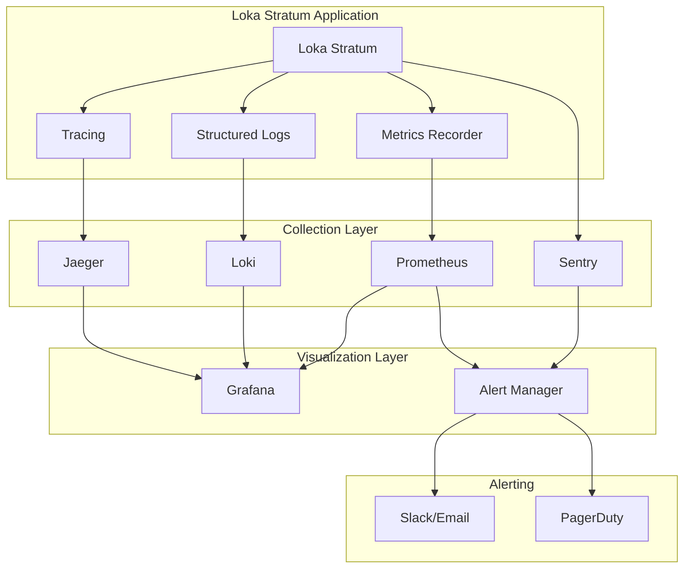

# Loka Stratum Monitoring Guide

Comprehensive monitoring and observability guide for Loka Stratum Bitcoin Mining Proxy, covering dashboards, metrics, alerts, and performance analysis.

## Table of Contents

- [Overview](#overview)
- [Monitoring Stack](#monitoring-stack)
- [Dashboard Guide](#dashboard-guide)
- [Metrics Reference](#metrics-reference)
- [Alert Configuration](#alert-configuration)
- [Performance Baselines](#performance-baselines)
- [Capacity Planning](#capacity-planning)
- [Integration Guide](#integration-guide)
- [Troubleshooting Monitoring](#troubleshooting-monitoring)
- [Custom Dashboards](#custom-dashboards)

## Overview

The Loka Stratum monitoring system provides comprehensive observability through:

- **Real-time Metrics**: Atomic counters, gauges, and histograms
- **Visualization**: Pre-built Grafana dashboards
- **Alerting**: Prometheus AlertManager integration
- **Error Tracking**: Sentry integration for error analysis
- **Performance Monitoring**: System and application performance metrics
- **Log Analysis**: Structured logging with correlation

### Monitoring Architecture



## Monitoring Stack

### Services Overview

| Service | Port | Purpose | Status Endpoint |
|---------|------|---------|----------------|
| Loka Stratum | 3333, 9090 | Main application | `http://localhost:9090/health` |
| Prometheus | 9090 | Metrics collection | `http://localhost:9090/targets` |
| Grafana | 3000 | Visualization | `http://localhost:3000` |
| AlertManager | 9093 | Alert routing | `http://localhost:9093` |
| Sentry | 9000 | Error tracking | `http://localhost:9000` |
| Node Exporter | 9100 | System metrics | `http://localhost:9100/metrics` |
| cAdvisor | 8080 | Container metrics | `http://localhost:8080/metrics` |

### Quick Start

```bash
# Deploy monitoring stack
cd monitoring
docker-compose up -d

# Initialize Sentry (wait 30 seconds after stack start)
./deploy-sentry.sh

# Verify all services
docker-compose ps
curl http://localhost:3000  # Grafana
curl http://localhost:9090  # Prometheus
curl http://localhost:9000  # Sentry
```

## Dashboard Guide

### 1. Loka Stratum Overview Dashboard

**Access:** Grafana → Dashboards → Loka Stratum Overview

#### Key Panels

**Connection Metrics**
- **Active Connections**: Real-time count of active miner connections
- **Connection Rate**: New connections per second
- **Connection Duration**: Average connection lifetime
- **Connection Errors**: Failed connection attempts

**Mining Performance**
- **Share Submission Rate**: Shares submitted per second
- **Share Acceptance Rate**: Percentage of accepted shares
- **Job Distribution Rate**: Mining jobs distributed per second
- **Pool Latency**: Round-trip time to mining pool

**System Health**
- **CPU Usage**: Application CPU utilization
- **Memory Usage**: RAM consumption with limits
- **Network I/O**: Bytes sent/received per second
- **Disk Usage**: Storage utilization

#### Usage Guide

```bash
# View dashboard metrics via API
curl -s "http://localhost:3000/api/dashboards/db/loka-stratum-overview" \
  -H "Authorization: Bearer $GRAFANA_TOKEN"

# Export dashboard
curl -s "http://localhost:3000/api/dashboards/db/loka-stratum-overview" \
  | jq '.dashboard' > loka-stratum-overview.json
```

### 2. Loka Stratum Comprehensive Dashboard

**Access:** Grafana → Dashboards → Loka Stratum Comprehensive

#### Advanced Panels

**Protocol Analysis**
- **Message Types**: Distribution of Stratum message types
- **Authentication Success Rate**: Login success/failure rates
- **Protocol Errors**: Parsing and validation errors
- **Message Size Distribution**: Histogram of message sizes

**Performance Deep Dive**
- **Response Time Histogram**: Request processing time distribution
- **Atomic Metrics Performance**: Sub-microsecond metric operations
- **Memory Pool Usage**: String interning and object pooling
- **Connection Pool Efficiency**: Pool utilization metrics

**Resource Management**
- **Thread Pool Usage**: Tokio runtime thread utilization
- **File Descriptor Usage**: Open file handles
- **TCP Socket States**: Connection state distribution
- **Database Connection Pool**: Active/idle connection ratios

#### Queries and Filters

```promql
# Active connections by pool
loka_stratum_connections_active{pool_name=~".*"}

# Share acceptance rate over time
rate(loka_stratum_shares_accepted_total[5m]) / rate(loka_stratum_shares_submitted_total[5m])

# 95th percentile response time
histogram_quantile(0.95, rate(loka_stratum_response_time_seconds_bucket[5m]))

# Memory usage trend
loka_stratum_memory_usage_bytes / 1024 / 1024

# Error rate by type
rate(loka_stratum_errors_total{error_type=~".*"}[5m])
```

### 3. System Overview Dashboard

**Access:** Grafana → Dashboards → System Overview

#### Infrastructure Monitoring

**Host Metrics (Node Exporter)**
- **CPU Usage**: Per-core utilization
- **Memory Usage**: Available, used, cached
- **Disk I/O**: Read/write operations per second
- **Network Traffic**: Interface statistics
- **Load Average**: System load over time

**Container Metrics (cAdvisor)**
- **Container CPU**: Per-container CPU usage
- **Container Memory**: Memory limits and usage
- **Container Network**: Network I/O per container
- **Container Filesystem**: Disk usage per container

**Docker Engine**
- **Container Count**: Running/stopped containers
- **Image Count**: Local Docker images
- **Volume Usage**: Docker volume disk usage
- **Docker Events**: Container lifecycle events

### 4. Error Tracking Dashboard

**Access:** Grafana → Dashboards → Error Tracking

#### Error Analysis Panels

**Error Overview**
- **Total Errors**: Error count over time
- **Error Rate**: Errors per second
- **Top Error Types**: Most frequent error categories
- **Error Distribution**: Errors by component

**Sentry Integration**
- **New Issues**: Recently discovered errors
- **Issue Trends**: Issue frequency over time
- **Performance Issues**: Slow transactions
- **Release Health**: Error rates by release version

## Metrics Reference

### Connection Metrics

| Metric | Type | Description | Labels |
|--------|------|-------------|---------|
| `loka_stratum_connections_total` | Counter | Total connections established | `pool_name` |
| `loka_stratum_connections_active` | Gauge | Currently active connections | `pool_name` |
| `loka_stratum_connections_duration_seconds` | Histogram | Connection duration distribution | `pool_name` |
| `loka_stratum_connection_errors_total` | Counter | Connection establishment failures | `error_type`, `pool_name` |

### Mining Metrics

| Metric | Type | Description | Labels |
|--------|------|-------------|---------|
| `loka_stratum_shares_submitted_total` | Counter | Total shares submitted | `worker_name`, `pool_name` |
| `loka_stratum_shares_accepted_total` | Counter | Total shares accepted | `worker_name`, `pool_name` |
| `loka_stratum_shares_rejected_total` | Counter | Total shares rejected | `worker_name`, `pool_name`, `reason` |
| `loka_stratum_jobs_distributed_total` | Counter | Total mining jobs distributed | `pool_name` |
| `loka_stratum_difficulty_current` | Gauge | Current mining difficulty | `pool_name` |

### Protocol Metrics

| Metric | Type | Description | Labels |
|--------|------|-------------|---------|
| `loka_stratum_messages_received_total` | Counter | Total messages received | `method`, `pool_name` |
| `loka_stratum_messages_sent_total` | Counter | Total messages sent | `method`, `pool_name` |
| `loka_stratum_protocol_errors_total` | Counter | Protocol parsing errors | `error_type` |
| `loka_stratum_auth_attempts_total` | Counter | Authentication attempts | `result`, `pool_name` |

### Performance Metrics

| Metric | Type | Description | Labels |
|--------|------|-------------|---------|
| `loka_stratum_response_time_seconds` | Histogram | Request processing time | `method` |
| `loka_stratum_pool_latency_seconds` | Histogram | Pool communication latency | `pool_name` |
| `loka_stratum_memory_usage_bytes` | Gauge | Current memory usage | |
| `loka_stratum_cpu_usage_percent` | Gauge | CPU utilization percentage | |

### Database Metrics

| Metric | Type | Description | Labels |
|--------|------|-------------|---------|
| `loka_stratum_db_connections_active` | Gauge | Active database connections | |
| `loka_stratum_db_connections_idle` | Gauge | Idle database connections | |
| `loka_stratum_db_query_duration_seconds` | Histogram | Database query execution time | `query_type` |
| `loka_stratum_db_errors_total` | Counter | Database operation errors | `error_type` |

### Custom Metrics Examples

```rust
use metrics::{counter, gauge, histogram};

// Connection tracking
counter!("loka_stratum_connections_total", "pool_name" => pool_name).increment(1);
gauge!("loka_stratum_connections_active", "pool_name" => pool_name).set(active_count as f64);

// Performance measurement
let start = Instant::now();
// ... operation ...
histogram!("loka_stratum_response_time_seconds", "method" => "mining.submit")
    .record(start.elapsed().as_secs_f64());

// Error tracking
counter!("loka_stratum_errors_total", 
    "error_type" => error_type,
    "component" => "protocol_handler"
).increment(1);
```

## Alert Configuration

### Prometheus Alert Rules

Located in `monitoring/prometheus/rules/loka-stratum.yml`:

#### Critical Alerts

**Service Down**
```yaml
- alert: LokaStratumDown
  expr: up{job="loka-stratum"} == 0
  for: 1m
  labels:
    severity: critical
  annotations:
    summary: "Loka Stratum service is down"
    description: "Loka Stratum has been down for more than 1 minute"
```

**High Error Rate**
```yaml
- alert: HighErrorRate
  expr: rate(loka_stratum_errors_total[5m]) > 10
  for: 5m
  labels:
    severity: critical
  annotations:
    summary: "High error rate detected"
    description: "Error rate is {{ $value }} errors/sec over 5 minutes"
```

**Memory Usage High**
```yaml
- alert: HighMemoryUsage
  expr: loka_stratum_memory_usage_bytes / 1024 / 1024 / 1024 > 2
  for: 10m
  labels:
    severity: warning
  annotations:
    summary: "High memory usage"
    description: "Memory usage is {{ $value }}GB"
```

#### Performance Alerts

**High Response Time**
```yaml
- alert: HighResponseTime
  expr: histogram_quantile(0.95, rate(loka_stratum_response_time_seconds_bucket[5m])) > 1
  for: 5m
  labels:
    severity: warning
  annotations:
    summary: "High response time"
    description: "95th percentile response time is {{ $value }}s"
```

**Connection Limit Approaching**
```yaml
- alert: ConnectionLimitApproaching
  expr: loka_stratum_connections_active / 1000 > 0.9
  for: 5m
  labels:
    severity: warning
  annotations:
    summary: "Connection limit approaching"
    description: "{{ $value | humanizePercentage }} of connection limit reached"
```

**Pool Disconnection**
```yaml
- alert: PoolDisconnected
  expr: loka_stratum_pool_connection_status == 0
  for: 2m
  labels:
    severity: critical
  annotations:
    summary: "Mining pool disconnected"
    description: "Connection to pool {{ $labels.pool_name }} is down"
```

### AlertManager Configuration

Located in `monitoring/alertmanager/alertmanager.yml`:

```yaml
global:
  smtp_smarthost: 'smtp.gmail.com:587'
  smtp_from: 'alerts@loka-stratum.org'

route:
  group_by: ['alertname']
  group_wait: 10s
  group_interval: 5m
  repeat_interval: 12h
  receiver: 'default'
  routes:
  - match:
      severity: critical
    receiver: 'critical-alerts'
  - match:
      severity: warning
    receiver: 'warning-alerts'

receivers:
- name: 'default'
  email_configs:
  - to: 'ops-team@loka-stratum.org'
    subject: 'Loka Stratum Alert: {{ .GroupLabels.alertname }}'
    body: |
      {{ range .Alerts }}
      Alert: {{ .Annotations.summary }}
      Description: {{ .Annotations.description }}
      Labels: {{ range .Labels.SortedPairs }}{{ .Name }}={{ .Value }} {{ end }}
      {{ end }}

- name: 'critical-alerts'
  email_configs:
  - to: 'oncall@loka-stratum.org'
    subject: 'CRITICAL: {{ .GroupLabels.alertname }}'
  slack_configs:
  - api_url: 'https://hooks.slack.com/services/YOUR/SLACK/WEBHOOK'
    channel: '#critical-alerts'
    title: 'CRITICAL: {{ .GroupLabels.alertname }}'
    text: '{{ range .Alerts }}{{ .Annotations.description }}{{ end }}'

- name: 'warning-alerts'
  email_configs:
  - to: 'ops-team@loka-stratum.org'
    subject: 'WARNING: {{ .GroupLabels.alertname }}'
```

### Webhook Integration

```python
#!/usr/bin/env python3
# webhook-receiver.py - Custom alert webhook receiver

from flask import Flask, request, jsonify
import json
import logging
import requests

app = Flask(__name__)
logging.basicConfig(level=logging.INFO)

@app.route('/webhook/alerts', methods=['POST'])
def receive_alert():
    try:
        alerts = request.json['alerts']
        
        for alert in alerts:
            alert_name = alert['labels']['alertname']
            severity = alert['labels']['severity']
            description = alert['annotations']['description']
            
            # Log alert
            logging.info(f"Received {severity} alert: {alert_name} - {description}")
            
            # Process critical alerts
            if severity == 'critical':
                process_critical_alert(alert_name, description)
            
        return jsonify({'status': 'ok'})
    
    except Exception as e:
        logging.error(f"Error processing webhook: {e}")
        return jsonify({'error': str(e)}), 500

def process_critical_alert(alert_name, description):
    # Auto-remediation for specific alerts
    if alert_name == 'LokaStratumDown':
        restart_service()
    elif alert_name == 'HighMemoryUsage':
        trigger_memory_cleanup()

def restart_service():
    logging.info("Attempting automatic service restart")
    # Implementation depends on deployment method
    # Docker: subprocess.run(['docker-compose', 'restart', 'loka-stratum'])
    # Kubernetes: subprocess.run(['kubectl', 'rollout', 'restart', 'deployment/loka-stratum'])

if __name__ == '__main__':
    app.run(host='0.0.0.0', port=8080)
```

## Performance Baselines

### Expected Performance Metrics

#### Connection Performance
- **Max Concurrent Connections**: 1,000 (default config)
- **Connection Establishment Time**: < 100ms (95th percentile)
- **Connection Throughput**: > 500 connections/second
- **Connection Error Rate**: < 1%

#### Mining Performance
- **Share Processing Time**: < 10ms (95th percentile)
- **Job Distribution Latency**: < 50ms (95th percentile)
- **Share Acceptance Rate**: > 95% (depends on pool)
- **Protocol Message Throughput**: > 10,000 messages/second

#### System Performance
- **CPU Usage**: < 50% under normal load
- **Memory Usage**: < 2GB for 1,000 connections
- **Network Bandwidth**: Depends on miner count and hash rate
- **Disk I/O**: < 100 MB/hour (primarily logs)

#### Database Performance
- **Query Response Time**: < 5ms (95th percentile)
- **Connection Pool Usage**: < 70%
- **Transaction Rate**: > 1,000 transactions/second
- **Database Size Growth**: ~1GB per million submissions

### Benchmark Scenarios

#### Load Testing Configuration

```toml
# benchmark-config.toml
[load_test]
concurrent_miners = 1000
test_duration = "30m"
ramp_up_time = "5m"
share_submission_rate = 10  # shares per minute per miner

[pool]
host = "testnet-pool.example.com"
port = 4444
username = "test_user"

[expectations]
max_response_time = "100ms"
max_error_rate = 0.01
min_throughput = 500
```

#### Benchmark Execution

```bash
# Run comprehensive benchmarks
cd stratum
./run_benchmarks.sh comprehensive

# Generate performance report
./run_benchmarks.sh report --format json --output performance-report.json

# Compare with baseline
./run_benchmarks.sh compare --baseline production-v1.0 --current latest

# Stress test specific components
./run_benchmarks.sh stress --component connection_manager --duration 10m
```

### Performance Regression Detection

```python
#!/usr/bin/env python3
# performance-regression-check.py

import json
import sys
from datetime import datetime, timedelta

def check_performance_regression(current_metrics, baseline_metrics):
    """Check for performance regressions against baseline"""
    
    regressions = []
    
    # Define regression thresholds (% degradation)
    thresholds = {
        'response_time_p95': 20,  # 20% slower
        'throughput': -10,        # 10% less throughput
        'error_rate': 50,         # 50% more errors
        'memory_usage': 30,       # 30% more memory
        'cpu_usage': 25           # 25% more CPU
    }
    
    for metric, threshold in thresholds.items():
        if metric not in current_metrics or metric not in baseline_metrics:
            continue
            
        current_value = current_metrics[metric]
        baseline_value = baseline_metrics[metric]
        
        if baseline_value == 0:
            continue
            
        change_percent = ((current_value - baseline_value) / baseline_value) * 100
        
        if change_percent > threshold:
            regressions.append({
                'metric': metric,
                'current': current_value,
                'baseline': baseline_value,
                'change_percent': change_percent,
                'threshold': threshold
            })
    
    return regressions

def main():
    if len(sys.argv) != 3:
        print("Usage: python3 performance-regression-check.py <current.json> <baseline.json>")
        sys.exit(1)
    
    with open(sys.argv[1]) as f:
        current_metrics = json.load(f)
    
    with open(sys.argv[2]) as f:
        baseline_metrics = json.load(f)
    
    regressions = check_performance_regression(current_metrics, baseline_metrics)
    
    if regressions:
        print(f"Found {len(regressions)} performance regressions:")
        for reg in regressions:
            print(f"  {reg['metric']}: {reg['change_percent']:.1f}% degradation "
                  f"(current: {reg['current']}, baseline: {reg['baseline']})")
        sys.exit(1)
    else:
        print("No performance regressions detected")
        sys.exit(0)

if __name__ == '__main__':
    main()
```

## Capacity Planning

### Resource Planning Models

#### Connection-Based Planning

```python
# capacity-planning.py
def calculate_resources(target_connections, avg_connection_duration_hours):
    """Calculate resource requirements based on target connections"""
    
    # Base resource requirements per 1000 connections
    base_cpu_cores = 2
    base_memory_gb = 2
    base_network_mbps = 100
    base_storage_gb_per_day = 1
    
    # Scale factors
    cpu_scaling = target_connections / 1000 * base_cpu_cores
    memory_scaling = target_connections / 1000 * base_memory_gb
    network_scaling = target_connections / 1000 * base_network_mbps
    storage_scaling = target_connections / 1000 * base_storage_gb_per_day
    
    # Add overhead for peaks and safety margin
    safety_margin = 1.5
    
    return {
        'cpu_cores': int(cpu_scaling * safety_margin) + 1,
        'memory_gb': int(memory_scaling * safety_margin) + 1,
        'network_mbps': int(network_scaling * safety_margin),
        'storage_gb_per_day': int(storage_scaling * safety_margin)
    }

# Example usage
requirements = calculate_resources(5000, 8)
print(f"For 5000 concurrent connections:")
print(f"CPU: {requirements['cpu_cores']} cores")
print(f"Memory: {requirements['memory_gb']} GB")
print(f"Network: {requirements['network_mbps']} Mbps")
print(f"Storage: {requirements['storage_gb_per_day']} GB/day")
```

#### Growth Projection

```sql
-- capacity-growth-analysis.sql
-- Analyze connection growth trends

WITH daily_stats AS (
    SELECT 
        DATE(timestamp) as date,
        MAX(connections_active) as peak_connections,
        AVG(connections_active) as avg_connections
    FROM metrics_history 
    WHERE timestamp > NOW() - INTERVAL '30 days'
    GROUP BY DATE(timestamp)
),
growth_trend AS (
    SELECT 
        date,
        peak_connections,
        LAG(peak_connections, 7) OVER (ORDER BY date) as peak_connections_week_ago,
        (peak_connections - LAG(peak_connections, 7) OVER (ORDER BY date)) * 100.0 / 
        LAG(peak_connections, 7) OVER (ORDER BY date) as weekly_growth_rate
    FROM daily_stats
)
SELECT 
    AVG(weekly_growth_rate) as avg_weekly_growth_rate,
    MAX(peak_connections) as current_peak,
    MAX(peak_connections) * POWER(1 + AVG(weekly_growth_rate)/100, 12) as projected_peak_3months
FROM growth_trend 
WHERE weekly_growth_rate IS NOT NULL;
```

### Scaling Triggers

```yaml
# scaling-rules.yml
scaling_rules:
  scale_out:
    triggers:
      - metric: loka_stratum_connections_active
        threshold: 800  # 80% of 1000 connection limit
        duration: 5m
        action: add_instance
      
      - metric: loka_stratum_cpu_usage_percent
        threshold: 70
        duration: 10m
        action: add_instance
      
      - metric: loka_stratum_response_time_seconds_p95
        threshold: 0.5  # 500ms
        duration: 5m
        action: add_instance

  scale_in:
    triggers:
      - metric: loka_stratum_connections_active
        threshold: 300  # 30% of capacity
        duration: 15m
        action: remove_instance
      
      - metric: loka_stratum_cpu_usage_percent
        threshold: 20
        duration: 20m
        action: remove_instance

  scale_up:
    triggers:
      - metric: loka_stratum_memory_usage_percent
        threshold: 85
        duration: 5m
        action: increase_memory
      
      - metric: loka_stratum_db_connections_active
        threshold: 40  # 80% of 50 connection pool
        duration: 10m
        action: increase_db_pool
```

## Integration Guide

### Sentry Integration

#### Setup and Configuration

```rust
// sentry-integration.rs
use sentry::{ClientOptions, configure_scope, add_breadcrumb, Breadcrumb, Level};

pub fn init_sentry() -> Option<sentry::ClientInitGuard> {
    let dsn = std::env::var("SENTRY_DSN").ok()?;
    let environment = std::env::var("SENTRY_ENVIRONMENT")
        .unwrap_or_else(|_| "production".to_string());
    
    Some(sentry::init(ClientOptions {
        dsn: dsn.parse().ok(),
        environment: Some(environment.into()),
        sample_rate: 1.0,
        traces_sample_rate: 1.0,
        release: option_env!("CARGO_PKG_VERSION").map(Into::into),
        ..Default::default()
    }))
}

pub fn configure_mining_context(miner_id: &str, pool_name: &str) {
    configure_scope(|scope| {
        scope.set_tag("component", "mining_proxy");
        scope.set_tag("pool_name", pool_name);
        scope.set_user(Some(sentry::User {
            id: Some(miner_id.to_string()),
            ..Default::default()
        }));
    });
}

pub fn log_mining_event(event_type: &str, details: serde_json::Value) {
    add_breadcrumb(Breadcrumb {
        message: Some(format!("Mining event: {}", event_type)),
        level: Level::Info,
        category: Some("mining".into()),
        data: details.as_object().cloned()
            .unwrap_or_default()
            .into_iter()
            .map(|(k, v)| (k, v.to_string().into()))
            .collect(),
        ..Default::default()
    });
}
```

#### Custom Sentry Dashboard Panels

```json
{
  "title": "Sentry Error Tracking",
  "panels": [
    {
      "title": "Error Rate",
      "type": "graph",
      "targets": [
        {
          "expr": "rate(sentry_events_total{level=\"error\"}[5m])",
          "legendFormat": "Errors/sec"
        }
      ]
    },
    {
      "title": "Top Issues",
      "type": "table",
      "targets": [
        {
          "expr": "topk(10, rate(sentry_issues_total[1h]))",
          "format": "table"
        }
      ]
    },
    {
      "title": "Performance Issues",
      "type": "graph",
      "targets": [
        {
          "expr": "histogram_quantile(0.95, rate(sentry_transaction_duration_seconds_bucket[5m]))",
          "legendFormat": "95th percentile"
        }
      ]
    }
  ]
}
```

### External Monitoring Integration

#### Datadog Integration

```yaml
# datadog-integration.yml
apiVersion: v1
kind: ConfigMap
metadata:
  name: datadog-config
data:
  datadog.yaml: |
    api_key: "<your-datadog-api-key>"
    site: "datadoghq.com"
    logs_enabled: true
    
    integrations:
      prometheus:
        - prometheus_url: "http://prometheus:9090/metrics"
          namespace: "loka_stratum"
          metrics:
            - "loka_stratum_*"
```

#### New Relic Integration

```toml
# newrelic-config.toml
[telemetry.exporters.newrelic]
api_key = "${NEW_RELIC_API_KEY}"
account_id = "${NEW_RELIC_ACCOUNT_ID}"

[telemetry.processors.resource]
attributes = [
  { key = "service.name", value = "loka-stratum" },
  { key = "service.version", value = "${APP_VERSION}" }
]
```

### Custom Metrics Exporters

#### InfluxDB Exporter

```rust
// influxdb-exporter.rs
use influxdb::{Client, Query, Timestamp};
use metrics::recorder::Registry;
use tokio::time::{interval, Duration};

pub struct InfluxDBExporter {
    client: Client,
    registry: Registry,
}

impl InfluxDBExporter {
    pub fn new(url: &str, database: &str, registry: Registry) -> Self {
        let client = Client::new(url, database);
        Self { client, registry }
    }
    
    pub async fn start_export_loop(&self) {
        let mut interval = interval(Duration::from_secs(30));
        
        loop {
            interval.tick().await;
            if let Err(e) = self.export_metrics().await {
                tracing::error!("Failed to export metrics to InfluxDB: {}", e);
            }
        }
    }
    
    async fn export_metrics(&self) -> Result<(), influxdb::Error> {
        let snapshot = self.registry.get_snapshot();
        let timestamp = Timestamp::now();
        
        for (key, value) in snapshot.counters() {
            let query = Query::write_query(timestamp, "loka_stratum_counters")
                .add_field("value", value)
                .add_tag("metric", key.name())
                .add_tags(key.labels());
            
            self.client.query(query).await?;
        }
        
        for (key, value) in snapshot.gauges() {
            let query = Query::write_query(timestamp, "loka_stratum_gauges")
                .add_field("value", value)
                .add_tag("metric", key.name())
                .add_tags(key.labels());
            
            self.client.query(query).await?;
        }
        
        Ok(())
    }
}
```

## Troubleshooting Monitoring

### Common Issues

#### Prometheus Not Scraping Metrics

**Symptoms:**
- Missing data in Grafana dashboards
- "No data" errors in panels
- Prometheus targets showing as "DOWN"

**Diagnosis:**
```bash
# Check Prometheus targets
curl http://localhost:9090/api/v1/targets

# Test metrics endpoint manually
curl http://localhost:9090/metrics/prometheus

# Check Prometheus logs
docker-compose logs prometheus

# Verify network connectivity
docker exec prometheus-container ping loka-stratum-container
```

**Solutions:**
```bash
# Fix service discovery
docker-compose restart prometheus

# Update prometheus.yml configuration
nano monitoring/prometheus/prometheus.yml

# Check firewall rules
sudo ufw status
sudo iptables -L
```

#### Grafana Dashboard Not Loading

**Symptoms:**
- Blank dashboards
- "Template variables not loading"
- Query errors

**Diagnosis:**
```bash
# Check Grafana logs
docker-compose logs grafana

# Test Prometheus data source
curl -H "Authorization: Bearer $GRAFANA_TOKEN" \
  http://localhost:3000/api/datasources/proxy/1/api/v1/query?query=up

# Check dashboard JSON syntax
jq '.' grafana/dashboards/loka-stratum-overview.json
```

**Solutions:**
```bash
# Restart Grafana
docker-compose restart grafana

# Re-import dashboard
curl -X POST \
  -H "Authorization: Bearer $GRAFANA_TOKEN" \
  -H "Content-Type: application/json" \
  -d @loka-stratum-overview.json \
  http://localhost:3000/api/dashboards/db

# Reset admin password
docker-compose exec grafana grafana-cli admin reset-admin-password newpassword
```

#### High Memory Usage by Prometheus

**Symptoms:**
- Prometheus container OOM kills
- Slow query performance
- High disk usage

**Diagnosis:**
```bash
# Check Prometheus memory usage
docker stats prometheus-container

# Check storage usage
du -sh /var/lib/docker/volumes/monitoring_prometheus-data/

# Check retention settings
grep retention monitoring/docker-compose.yml
```

**Solutions:**
```bash
# Reduce retention time
# Edit docker-compose.yml
- '--storage.tsdb.retention.time=15d'
- '--storage.tsdb.retention.size=10GB'

# Increase memory limits
services:
  prometheus:
    deploy:
      resources:
        limits:
          memory: 4G

# Clean old data
docker exec prometheus-container rm -rf /prometheus/data/chunks_head/
```

#### Sentry Not Receiving Events

**Symptoms:**
- No events in Sentry dashboard
- Missing error reports
- Performance data not appearing

**Diagnosis:**
```bash
# Check Sentry logs
docker-compose logs sentry

# Test DSN connectivity
curl -X POST \
  -H "Content-Type: application/json" \
  -d '{"message":"test"}' \
  "$SENTRY_DSN/api/1/store/"

# Check application Sentry configuration
grep -r SENTRY_DSN .env docker-compose.yml
```

**Solutions:**
```bash
# Reinitialize Sentry
cd monitoring && ./deploy-sentry.sh

# Check Sentry configuration
docker exec monitoring-sentry-1 cat /etc/sentry/config.yml

# Test application integration
curl -X POST http://localhost:9090/test-sentry
```

### Performance Troubleshooting

#### Dashboard Loading Slowly

```bash
# Optimize Prometheus queries
# Use rate() instead of increase() for counters
rate(loka_stratum_connections_total[5m])

# Reduce query time range
# Use shorter time ranges for complex queries

# Add query caching
services:
  grafana:
    environment:
      - GF_DATABASE_CACHE_TTL=300s
```

#### Missing Historical Data

```bash
# Check Prometheus retention
docker exec prometheus-container ls -la /prometheus/data/

# Verify data integrity
docker exec prometheus-container /bin/promtool tsdb analyze /prometheus/data/

# Backup and restore if needed
docker run --rm -v monitoring_prometheus-data:/data -v $(pwd):/backup \
  alpine tar czf /backup/prometheus-backup-$(date +%Y%m%d).tar.gz /data
```

## Custom Dashboards

### Creating Custom Dashboard

```json
{
  "dashboard": {
    "id": null,
    "title": "Custom Loka Stratum Dashboard",
    "tags": ["loka-stratum", "custom"],
    "timezone": "browser",
    "panels": [
      {
        "id": 1,
        "title": "Custom Metric Panel",
        "type": "graph",
        "targets": [
          {
            "expr": "your_custom_metric{instance=\"$instance\"}",
            "legendFormat": "Custom Metric",
            "refId": "A"
          }
        ],
        "xAxis": {
          "show": true,
          "mode": "time"
        },
        "yAxis": {
          "show": true,
          "logBase": 1,
          "min": null,
          "max": null
        },
        "gridPos": {
          "h": 9,
          "w": 12,
          "x": 0,
          "y": 0
        }
      }
    ],
    "templating": {
      "list": [
        {
          "name": "instance",
          "type": "query",
          "query": "label_values(loka_stratum_connections_active, instance)",
          "refresh": 1,
          "multi": false,
          "includeAll": false
        }
      ]
    },
    "time": {
      "from": "now-1h",
      "to": "now"
    },
    "refresh": "5s"
  }
}
```

### Dashboard Provisioning

```yaml
# grafana/provisioning/dashboards/custom.yml
apiVersion: 1

providers:
  - name: 'custom-dashboards'
    orgId: 1
    folder: 'Custom'
    type: file
    disableDeletion: false
    updateIntervalSeconds: 30
    allowUiUpdates: true
    options:
      path: /var/lib/grafana/dashboards/custom
```

For additional monitoring support, see:
- [Deployment Guide](DEPLOYMENT.md) for infrastructure monitoring setup
- [Operations Manual](OPERATIONS.md) for operational monitoring procedures
- [API Documentation](API.md) for metrics endpoint specifications
- [Security Guide](SECURITY.md) for security monitoring best practices