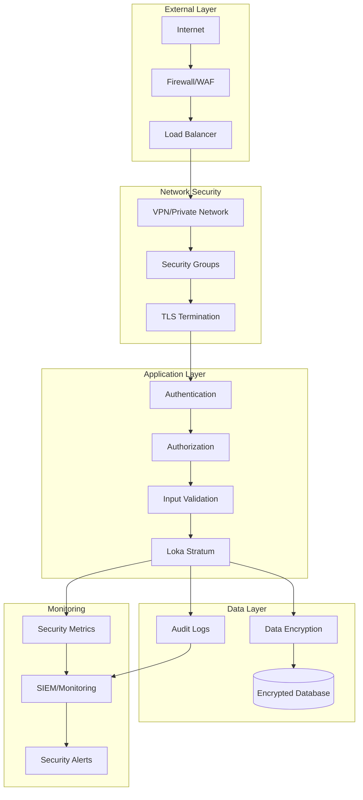

# Loka Stratum Security Guide

Comprehensive security guide for deploying and operating Loka Stratum Bitcoin Mining Proxy in production environments, covering network security, authentication, monitoring, and incident response.

## Table of Contents

- [Security Overview](#security-overview)
- [Network Security](#network-security)
- [Authentication & Authorization](#authentication--authorization)
- [Data Protection](#data-protection)
- [Container Security](#container-security)
- [Database Security](#database-security)
- [Monitoring & Alerting](#monitoring--alerting)
- [Incident Response](#incident-response)
- [Compliance](#compliance)
- [Security Hardening](#security-hardening)

## Security Overview

### Security Architecture



### Security Principles

1. **Defense in Depth**: Multiple security layers
2. **Least Privilege**: Minimal required permissions
3. **Zero Trust**: Verify all connections and requests
4. **Encryption Everywhere**: Data in transit and at rest
5. **Continuous Monitoring**: Real-time threat detection
6. **Incident Response**: Rapid detection and response
7. **Regular Updates**: Keep all components updated
8. **Audit Everything**: Comprehensive logging and auditing

### Threat Model

#### External Threats
- **DDoS Attacks**: Volumetric and application-layer attacks
- **Mining Pool Impersonation**: Malicious pool redirection
- **Man-in-the-Middle**: Network traffic interception
- **Credential Stuffing**: Automated login attempts
- **API Abuse**: Excessive API calls and scraping

#### Internal Threats
- **Privilege Escalation**: Unauthorized access elevation
- **Data Exfiltration**: Unauthorized data access
- **Configuration Tampering**: Malicious configuration changes
- **Resource Abuse**: Unauthorized resource consumption
- **Lateral Movement**: Compromise spreading to other systems

#### Infrastructure Threats
- **Container Escape**: Breaking out of container isolation
- **Supply Chain Attacks**: Compromised dependencies
- **Insider Threats**: Malicious internal actors
- **Misconfiguration**: Security control bypasses
- **Unpatched Vulnerabilities**: Known security flaws

## Network Security

### Firewall Configuration

#### UFW (Ubuntu Firewall)

```bash
# Default policies
sudo ufw default deny incoming
sudo ufw default allow outgoing

# Essential services
sudo ufw allow 22/tcp      # SSH (restrict to admin IPs)
sudo ufw allow 443/tcp     # HTTPS
sudo ufw allow 80/tcp      # HTTP (redirect to HTTPS)

# Loka Stratum services
sudo ufw allow 3333/tcp    # Stratum protocol
sudo ufw allow from 10.0.0.0/8 to any port 9090  # Metrics (internal only)

# Database access (restrict to application servers)
sudo ufw allow from 10.0.1.0/24 to any port 5432

# Enable firewall
sudo ufw enable
```

#### iptables Rules

```bash
#!/bin/bash
# firewall-rules.sh

# Flush existing rules
iptables -F
iptables -X
iptables -t nat -F
iptables -t nat -X

# Default policies
iptables -P INPUT DROP
iptables -P FORWARD DROP
iptables -P OUTPUT ACCEPT

# Allow loopback
iptables -A INPUT -i lo -j ACCEPT

# Allow established connections
iptables -A INPUT -m state --state ESTABLISHED,RELATED -j ACCEPT

# SSH access (restrict to admin IPs)
iptables -A INPUT -p tcp --dport 22 -s 203.0.113.0/24 -j ACCEPT

# HTTPS/HTTP
iptables -A INPUT -p tcp --dport 443 -j ACCEPT
iptables -A INPUT -p tcp --dport 80 -j ACCEPT

# Stratum mining protocol
iptables -A INPUT -p tcp --dport 3333 -j ACCEPT

# Rate limiting for Stratum connections
iptables -A INPUT -p tcp --dport 3333 -m limit --limit 100/minute -j ACCEPT
iptables -A INPUT -p tcp --dport 3333 -j DROP

# Metrics access (internal network only)
iptables -A INPUT -p tcp --dport 9090 -s 10.0.0.0/8 -j ACCEPT

# Anti-DDoS measures
iptables -A INPUT -p tcp --syn -m limit --limit 1/s -j ACCEPT
iptables -A INPUT -p icmp --icmp-type echo-request -m limit --limit 1/s -j ACCEPT

# Log dropped packets
iptables -A INPUT -m limit --limit 5/min -j LOG --log-prefix "iptables denied: "

# Save rules
iptables-save > /etc/iptables/rules.v4
```

### Network Segmentation

#### VPC Configuration (AWS)

```yaml
# network-security.yml
VPC:
  Type: AWS::EC2::VPC
  Properties:
    CidrBlock: 10.0.0.0/16
    EnableDnsHostnames: true
    EnableDnsSupport: true

# Public subnet for load balancer
PublicSubnet:
  Type: AWS::EC2::Subnet
  Properties:
    VpcId: !Ref VPC
    CidrBlock: 10.0.1.0/24
    MapPublicIpOnLaunch: true

# Private subnet for application
PrivateSubnet:
  Type: AWS::EC2::Subnet
  Properties:
    VpcId: !Ref VPC
    CidrBlock: 10.0.2.0/24
    MapPublicIpOnLaunch: false

# Database subnet
DatabaseSubnet:
  Type: AWS::EC2::Subnet
  Properties:
    VpcId: !Ref VPC
    CidrBlock: 10.0.3.0/24
    MapPublicIpOnLaunch: false

# Security groups
WebSecurityGroup:
  Type: AWS::EC2::SecurityGroup
  Properties:
    GroupDescription: Web tier security group
    VpcId: !Ref VPC
    SecurityGroupIngress:
      - IpProtocol: tcp
        FromPort: 443
        ToPort: 443
        CidrIp: 0.0.0.0/0
      - IpProtocol: tcp
        FromPort: 3333
        ToPort: 3333
        CidrIp: 0.0.0.0/0

AppSecurityGroup:
  Type: AWS::EC2::SecurityGroup
  Properties:
    GroupDescription: Application tier security group
    VpcId: !Ref VPC
    SecurityGroupIngress:
      - IpProtocol: tcp
        FromPort: 3333
        ToPort: 3333
        SourceSecurityGroupId: !Ref WebSecurityGroup
      - IpProtocol: tcp
        FromPort: 9090
        ToPort: 9090
        SourceSecurityGroupId: !Ref WebSecurityGroup

DatabaseSecurityGroup:
  Type: AWS::EC2::SecurityGroup
  Properties:
    GroupDescription: Database tier security group
    VpcId: !Ref VPC
    SecurityGroupIngress:
      - IpProtocol: tcp
        FromPort: 5432
        ToPort: 5432
        SourceSecurityGroupId: !Ref AppSecurityGroup
```

### TLS/SSL Configuration

#### Certificate Management

```bash
# Generate private key
openssl genrsa -out loka-stratum.key 4096

# Generate certificate signing request
openssl req -new -key loka-stratum.key -out loka-stratum.csr \
  -subj "/C=US/ST=CA/L=San Francisco/O=Loka Stratum/CN=loka-stratum.com"

# Self-signed certificate (development)
openssl x509 -req -days 365 -in loka-stratum.csr \
  -signkey loka-stratum.key -out loka-stratum.crt

# Let's Encrypt certificate (production)
certbot certonly --standalone -d loka-stratum.com -d api.loka-stratum.com

# Certificate validation
openssl x509 -in loka-stratum.crt -text -noout
openssl verify -CAfile ca-bundle.crt loka-stratum.crt
```

#### Nginx TLS Configuration

```nginx
# /etc/nginx/sites-available/loka-stratum
server {
    listen 443 ssl http2;
    server_name loka-stratum.com;

    # TLS configuration
    ssl_certificate /etc/letsencrypt/live/loka-stratum.com/fullchain.pem;
    ssl_certificate_key /etc/letsencrypt/live/loka-stratum.com/privkey.pem;
    
    # SSL security settings
    ssl_protocols TLSv1.2 TLSv1.3;
    ssl_ciphers ECDHE-RSA-AES256-GCM-SHA512:DHE-RSA-AES256-GCM-SHA512:ECDHE-RSA-AES256-GCM-SHA384:DHE-RSA-AES256-GCM-SHA384;
    ssl_prefer_server_ciphers off;
    ssl_session_cache shared:SSL:10m;
    ssl_session_timeout 10m;
    ssl_session_tickets off;
    
    # HSTS
    add_header Strict-Transport-Security "max-age=31536000; includeSubDomains" always;
    
    # Security headers
    add_header X-Frame-Options DENY always;
    add_header X-Content-Type-Options nosniff always;
    add_header X-XSS-Protection "1; mode=block" always;
    add_header Referrer-Policy "strict-origin-when-cross-origin" always;
    add_header Content-Security-Policy "default-src 'self'; script-src 'self' 'unsafe-inline'; style-src 'self' 'unsafe-inline'" always;
    
    # OCSP stapling
    ssl_stapling on;
    ssl_stapling_verify on;
    ssl_trusted_certificate /etc/letsencrypt/live/loka-stratum.com/chain.pem;
    resolver 1.1.1.1 1.0.0.1 valid=300s;
    resolver_timeout 5s;

    location /metrics {
        # Restrict metrics access
        allow 10.0.0.0/8;
        deny all;
        
        proxy_pass http://localhost:9090;
        proxy_set_header Host $host;
        proxy_set_header X-Real-IP $remote_addr;
        proxy_set_header X-Forwarded-For $proxy_add_x_forwarded_for;
        proxy_set_header X-Forwarded-Proto $scheme;
    }
    
    location /health {
        proxy_pass http://localhost:9090;
        proxy_set_header Host $host;
        proxy_set_header X-Real-IP $remote_addr;
    }
}

# Redirect HTTP to HTTPS
server {
    listen 80;
    server_name loka-stratum.com;
    return 301 https://$server_name$request_uri;
}
```

### DDoS Protection

#### Rate Limiting Configuration

```nginx
# Rate limiting zones
http {
    # Connection rate limiting
    limit_conn_zone $remote_addr zone=conn_limit_per_ip:10m;
    limit_conn_zone $server_name zone=conn_limit_per_server:10m;
    
    # Request rate limiting
    limit_req_zone $remote_addr zone=req_limit_per_ip:10m rate=10r/s;
    limit_req_zone $remote_addr zone=stratum_limit:10m rate=100r/s;
    
    server {
        # Connection limits
        limit_conn conn_limit_per_ip 20;
        limit_conn conn_limit_per_server 1000;
        
        # Request limits
        limit_req zone=req_limit_per_ip burst=20 nodelay;
        
        location /stratum {
            limit_req zone=stratum_limit burst=200 nodelay;
            proxy_pass http://localhost:3333;
        }
        
        # Status codes for rate limiting
        limit_req_status 429;
        limit_conn_status 429;
    }
}
```

#### Application-Level Protection

```rust
// ddos-protection.rs
use std::collections::HashMap;
use std::net::IpAddr;
use std::sync::{Arc, RwLock};
use std::time::{Duration, Instant};
use tokio::time::sleep;

pub struct DDoSProtection {
    connection_counts: Arc<RwLock<HashMap<IpAddr, (u32, Instant)>>>,
    request_counts: Arc<RwLock<HashMap<IpAddr, Vec<Instant>>>>,
    config: DDoSConfig,
}

#[derive(Clone)]
pub struct DDoSConfig {
    pub max_connections_per_ip: u32,
    pub max_requests_per_minute: u32,
    pub ban_duration: Duration,
    pub cleanup_interval: Duration,
}

impl DDoSProtection {
    pub fn new(config: DDoSConfig) -> Self {
        let protection = Self {
            connection_counts: Arc::new(RwLock::new(HashMap::new())),
            request_counts: Arc::new(RwLock::new(HashMap::new())),
            config,
        };
        
        // Start cleanup task
        let protection_clone = protection.clone();
        tokio::spawn(async move {
            protection_clone.cleanup_task().await;
        });
        
        protection
    }
    
    pub fn check_connection_limit(&self, ip: IpAddr) -> bool {
        let mut counts = self.connection_counts.write().unwrap();
        let now = Instant::now();
        
        let (count, last_seen) = counts.entry(ip).or_insert((0, now));
        
        // Reset count if enough time has passed
        if now.duration_since(*last_seen) > self.config.ban_duration {
            *count = 0;
        }
        
        *count += 1;
        *last_seen = now;
        
        *count <= self.config.max_connections_per_ip
    }
    
    pub fn check_request_limit(&self, ip: IpAddr) -> bool {
        let mut counts = self.request_counts.write().unwrap();
        let now = Instant::now();
        let minute_ago = now - Duration::from_secs(60);
        
        let requests = counts.entry(ip).or_insert_with(Vec::new);
        
        // Remove old requests
        requests.retain(|&time| time > minute_ago);
        
        // Add current request
        requests.push(now);
        
        requests.len() <= self.config.max_requests_per_minute as usize
    }
    
    pub fn is_banned(&self, ip: IpAddr) -> bool {
        !self.check_connection_limit(ip) || !self.check_request_limit(ip)
    }
    
    async fn cleanup_task(&self) {
        let mut interval = tokio::time::interval(self.config.cleanup_interval);
        
        loop {
            interval.tick().await;
            
            let now = Instant::now();
            
            // Cleanup connection counts
            {
                let mut counts = self.connection_counts.write().unwrap();
                counts.retain(|_, (_, last_seen)| {
                    now.duration_since(*last_seen) < self.config.ban_duration
                });
            }
            
            // Cleanup request counts
            {
                let mut counts = self.request_counts.write().unwrap();
                let minute_ago = now - Duration::from_secs(60);
                
                for requests in counts.values_mut() {
                    requests.retain(|&time| time > minute_ago);
                }
                
                counts.retain(|_, requests| !requests.is_empty());
            }
        }
    }
}

// Middleware implementation
pub async fn ddos_protection_middleware(
    req: Request<Body>,
    next: Next<Body>,
) -> Result<Response<Body>, StatusCode> {
    let ip = get_client_ip(&req);
    let protection = get_ddos_protection(); // Get from app state
    
    if protection.is_banned(ip) {
        return Err(StatusCode::TOO_MANY_REQUESTS);
    }
    
    Ok(next.run(req).await)
}
```

## Authentication & Authorization

### API Authentication

#### JWT Token Implementation

```rust
// jwt-auth.rs
use jsonwebtoken::{decode, encode, DecodingKey, EncodingKey, Header, Validation};
use serde::{Deserialize, Serialize};
use std::time::{SystemTime, UNIX_EPOCH};

#[derive(Debug, Serialize, Deserialize)]
struct Claims {
    sub: String,          // Subject (user ID)
    exp: usize,           // Expiration time
    iat: usize,           // Issued at
    roles: Vec<String>,   // User roles
    permissions: Vec<String>, // Specific permissions
}

pub struct JwtService {
    encoding_key: EncodingKey,
    decoding_key: DecodingKey,
    validation: Validation,
}

impl JwtService {
    pub fn new(secret: &[u8]) -> Self {
        Self {
            encoding_key: EncodingKey::from_secret(secret),
            decoding_key: DecodingKey::from_secret(secret),
            validation: Validation::default(),
        }
    }
    
    pub fn create_token(&self, user_id: &str, roles: Vec<String>, 
                       permissions: Vec<String>) -> Result<String, jsonwebtoken::errors::Error> {
        let now = SystemTime::now().duration_since(UNIX_EPOCH).unwrap();
        let exp = now.as_secs() + 3600; // 1 hour expiration
        
        let claims = Claims {
            sub: user_id.to_owned(),
            exp: exp as usize,
            iat: now.as_secs() as usize,
            roles,
            permissions,
        };
        
        encode(&Header::default(), &claims, &self.encoding_key)
    }
    
    pub fn validate_token(&self, token: &str) -> Result<Claims, jsonwebtoken::errors::Error> {
        let token_data = decode::<Claims>(token, &self.decoding_key, &self.validation)?;
        Ok(token_data.claims)
    }
    
    pub fn has_permission(&self, token: &str, required_permission: &str) -> bool {
        match self.validate_token(token) {
            Ok(claims) => claims.permissions.contains(&required_permission.to_string()),
            Err(_) => false,
        }
    }
    
    pub fn has_role(&self, token: &str, required_role: &str) -> bool {
        match self.validate_token(token) {
            Ok(claims) => claims.roles.contains(&required_role.to_string()),
            Err(_) => false,
        }
    }
}

// Authentication middleware
pub async fn auth_middleware(
    req: Request<Body>,
    next: Next<Body>,
) -> Result<Response<Body>, StatusCode> {
    let auth_header = req.headers()
        .get(AUTHORIZATION)
        .and_then(|header| header.to_str().ok());
    
    let token = match auth_header {
        Some(header) if header.starts_with("Bearer ") => {
            &header[7..]
        }
        _ => return Err(StatusCode::UNAUTHORIZED),
    };
    
    let jwt_service = get_jwt_service(); // Get from app state
    
    match jwt_service.validate_token(token) {
        Ok(claims) => {
            // Add claims to request extensions for downstream use
            req.extensions_mut().insert(claims);
            Ok(next.run(req).await)
        }
        Err(_) => Err(StatusCode::UNAUTHORIZED),
    }
}
```

#### Role-Based Access Control (RBAC)

```rust
// rbac.rs
use std::collections::{HashMap, HashSet};

#[derive(Debug, Clone)]
pub enum Permission {
    // System permissions
    SystemRead,
    SystemWrite,
    SystemAdmin,
    
    // Mining permissions
    MiningView,
    MiningManage,
    WorkerView,
    WorkerManage,
    
    // Metrics permissions
    MetricsRead,
    MetricsManage,
    
    // Configuration permissions
    ConfigRead,
    ConfigWrite,
}

#[derive(Debug, Clone)]
pub enum Role {
    SuperAdmin,
    Admin,
    Operator,
    Monitor,
    ReadOnly,
}

pub struct RbacService {
    role_permissions: HashMap<Role, HashSet<Permission>>,
}

impl RbacService {
    pub fn new() -> Self {
        let mut role_permissions = HashMap::new();
        
        // Super Admin - all permissions
        role_permissions.insert(Role::SuperAdmin, vec![
            Permission::SystemRead,
            Permission::SystemWrite,
            Permission::SystemAdmin,
            Permission::MiningView,
            Permission::MiningManage,
            Permission::WorkerView,
            Permission::WorkerManage,
            Permission::MetricsRead,
            Permission::MetricsManage,
            Permission::ConfigRead,
            Permission::ConfigWrite,
        ].into_iter().collect());
        
        // Admin - most permissions except system admin
        role_permissions.insert(Role::Admin, vec![
            Permission::SystemRead,
            Permission::SystemWrite,
            Permission::MiningView,
            Permission::MiningManage,
            Permission::WorkerView,
            Permission::WorkerManage,
            Permission::MetricsRead,
            Permission::MetricsManage,
            Permission::ConfigRead,
            Permission::ConfigWrite,
        ].into_iter().collect());
        
        // Operator - manage mining operations
        role_permissions.insert(Role::Operator, vec![
            Permission::SystemRead,
            Permission::MiningView,
            Permission::MiningManage,
            Permission::WorkerView,
            Permission::WorkerManage,
            Permission::MetricsRead,
            Permission::ConfigRead,
        ].into_iter().collect());
        
        // Monitor - read-only access to metrics and status
        role_permissions.insert(Role::Monitor, vec![
            Permission::SystemRead,
            Permission::MiningView,
            Permission::WorkerView,
            Permission::MetricsRead,
            Permission::ConfigRead,
        ].into_iter().collect());
        
        // ReadOnly - minimal read access
        role_permissions.insert(Role::ReadOnly, vec![
            Permission::SystemRead,
            Permission::MiningView,
            Permission::MetricsRead,
        ].into_iter().collect());
        
        Self { role_permissions }
    }
    
    pub fn check_permission(&self, roles: &[Role], permission: &Permission) -> bool {
        roles.iter().any(|role| {
            self.role_permissions
                .get(role)
                .map_or(false, |perms| perms.contains(permission))
        })
    }
}

// Authorization middleware
pub fn require_permission(permission: Permission) -> impl Fn(Request<Body>, Next<Body>) -> Result<Response<Body>, StatusCode> + Clone {
    move |req: Request<Body>, next: Next<Body>| {
        let permission = permission.clone();
        async move {
            let claims = req.extensions().get::<Claims>()
                .ok_or(StatusCode::UNAUTHORIZED)?;
            
            let rbac_service = get_rbac_service(); // Get from app state
            let roles: Vec<Role> = claims.roles.iter()
                .filter_map(|r| serde_json::from_str(r).ok())
                .collect();
            
            if rbac_service.check_permission(&roles, &permission) {
                Ok(next.run(req).await)
            } else {
                Err(StatusCode::FORBIDDEN)
            }
        }
    }
}
```

### Stratum Authentication

#### Worker Authentication

```rust
// stratum-auth.rs
use std::collections::HashMap;
use std::sync::Arc;
use tokio::sync::RwLock;
use serde::{Deserialize, Serialize};

#[derive(Debug, Clone, Serialize, Deserialize)]
pub struct Worker {
    pub id: String,
    pub miner_id: String,
    pub pool_name: String,
    pub is_authenticated: bool,
    pub last_activity: chrono::DateTime<chrono::Utc>,
    pub permissions: Vec<String>,
}

#[derive(Debug, Clone)]
pub struct AuthConfig {
    pub require_auth: bool,
    pub auth_timeout: chrono::Duration,
    pub max_auth_attempts: u32,
    pub whitelist_pools: Vec<String>,
}

pub struct StratumAuthService {
    authenticated_workers: Arc<RwLock<HashMap<String, Worker>>>,
    auth_attempts: Arc<RwLock<HashMap<String, u32>>>,
    config: AuthConfig,
}

impl StratumAuthService {
    pub fn new(config: AuthConfig) -> Self {
        Self {
            authenticated_workers: Arc::new(RwLock::new(HashMap::new())),
            auth_attempts: Arc::new(RwLock::new(HashMap::new())),
            config,
        }
    }
    
    pub async fn authenticate_worker(&self, connection_id: &str, username: &str, 
                                   password: &str) -> Result<Worker, AuthError> {
        // Check authentication attempts
        {
            let mut attempts = self.auth_attempts.write().await;
            let count = attempts.entry(connection_id.to_string()).or_insert(0);
            
            if *count >= self.config.max_auth_attempts {
                return Err(AuthError::TooManyAttempts);
            }
            
            *count += 1;
        }
        
        // Parse username (format: miner.worker or just miner)
        let (miner_id, worker_name) = parse_username(username)?;
        
        // Validate credentials
        self.validate_credentials(&miner_id, password).await?;
        
        // Create worker session
        let worker = Worker {
            id: format!("{}_{}", connection_id, worker_name),
            miner_id: miner_id.clone(),
            pool_name: "default".to_string(), // TODO: get from config
            is_authenticated: true,
            last_activity: chrono::Utc::now(),
            permissions: self.get_worker_permissions(&miner_id).await?,
        };
        
        // Store authenticated worker
        {
            let mut workers = self.authenticated_workers.write().await;
            workers.insert(connection_id.to_string(), worker.clone());
        }
        
        // Clear auth attempts on success
        {
            let mut attempts = self.auth_attempts.write().await;
            attempts.remove(connection_id);
        }
        
        Ok(worker)
    }
    
    pub async fn is_authenticated(&self, connection_id: &str) -> bool {
        let workers = self.authenticated_workers.read().await;
        workers.contains_key(connection_id)
    }
    
    pub async fn get_worker(&self, connection_id: &str) -> Option<Worker> {
        let workers = self.authenticated_workers.read().await;
        workers.get(connection_id).cloned()
    }
    
    pub async fn update_activity(&self, connection_id: &str) {
        let mut workers = self.authenticated_workers.write().await;
        if let Some(worker) = workers.get_mut(connection_id) {
            worker.last_activity = chrono::Utc::now();
        }
    }
    
    pub async fn remove_worker(&self, connection_id: &str) {
        let mut workers = self.authenticated_workers.write().await;
        workers.remove(connection_id);
        
        let mut attempts = self.auth_attempts.write().await;
        attempts.remove(connection_id);
    }
    
    async fn validate_credentials(&self, miner_id: &str, password: &str) -> Result<(), AuthError> {
        // TODO: Implement credential validation
        // This could involve:
        // - Database lookup
        // - LDAP authentication
        // - API key validation
        // - Pool-specific authentication
        
        if miner_id.is_empty() {
            return Err(AuthError::InvalidCredentials);
        }
        
        // For now, accept any non-empty miner_id
        Ok(())
    }
    
    async fn get_worker_permissions(&self, miner_id: &str) -> Result<Vec<String>, AuthError> {
        // TODO: Get permissions from database or configuration
        Ok(vec![
            "mining.submit".to_string(),
            "mining.get_work".to_string(),
        ])
    }
}

#[derive(Debug, thiserror::Error)]
pub enum AuthError {
    #[error("Invalid credentials")]
    InvalidCredentials,
    #[error("Too many authentication attempts")]
    TooManyAttempts,
    #[error("Authentication required")]
    AuthRequired,
    #[error("Worker not found")]
    WorkerNotFound,
    #[error("Database error: {0}")]
    DatabaseError(String),
}

fn parse_username(username: &str) -> Result<(String, String), AuthError> {
    if username.contains('.') {
        let parts: Vec<&str> = username.split('.').collect();
        if parts.len() >= 2 {
            Ok((parts[0].to_string(), parts[1].to_string()))
        } else {
            Err(AuthError::InvalidCredentials)
        }
    } else {
        // Single username, use as both miner and worker
        Ok((username.to_string(), "default".to_string()))
    }
}
```

## Data Protection

### Encryption at Rest

#### Database Encryption

```sql
-- PostgreSQL encryption setup

-- Enable encryption
ALTER SYSTEM SET ssl = on;
ALTER SYSTEM SET ssl_cert_file = '/etc/ssl/certs/server.crt';
ALTER SYSTEM SET ssl_key_file = '/etc/ssl/private/server.key';

-- Create encrypted tablespace
CREATE TABLESPACE encrypted_ts LOCATION '/encrypted/data' 
WITH (encryption_key_id = 1);

-- Move sensitive tables to encrypted tablespace
ALTER TABLE miners SET TABLESPACE encrypted_ts;
ALTER TABLE workers SET TABLESPACE encrypted_ts;
ALTER TABLE submissions SET TABLESPACE encrypted_ts;

-- Encrypt specific columns
CREATE EXTENSION IF NOT EXISTS pgcrypto;

-- Encrypt sensitive data
ALTER TABLE miners ADD COLUMN email_encrypted BYTEA;
UPDATE miners SET email_encrypted = pgp_sym_encrypt(email, 'encryption_key');
ALTER TABLE miners DROP COLUMN email;
ALTER TABLE miners RENAME COLUMN email_encrypted TO email;

-- Function to decrypt data
CREATE OR REPLACE FUNCTION decrypt_email(encrypted_email BYTEA) 
RETURNS TEXT AS $$
BEGIN
  RETURN pgp_sym_decrypt(encrypted_email, 'encryption_key');
END;
$$ LANGUAGE plpgsql;
```

#### Application-Level Encryption

```rust
// encryption.rs
use aes_gcm::{Aes256Gcm, Key, Nonce};
use aes_gcm::aead::{Aead, NewAead};
use rand::{RngCore, rngs::OsRng};
use base64;

pub struct EncryptionService {
    cipher: Aes256Gcm,
}

impl EncryptionService {
    pub fn new(key: &[u8; 32]) -> Self {
        let key = Key::from_slice(key);
        let cipher = Aes256Gcm::new(key);
        
        Self { cipher }
    }
    
    pub fn encrypt(&self, data: &str) -> Result<String, Box<dyn std::error::Error>> {
        // Generate random nonce
        let mut nonce_bytes = [0u8; 12];
        OsRng.fill_bytes(&mut nonce_bytes);
        let nonce = Nonce::from_slice(&nonce_bytes);
        
        // Encrypt data
        let ciphertext = self.cipher.encrypt(nonce, data.as_bytes())?;
        
        // Combine nonce and ciphertext
        let mut result = Vec::new();
        result.extend_from_slice(&nonce_bytes);
        result.extend_from_slice(&ciphertext);
        
        Ok(base64::encode(&result))
    }
    
    pub fn decrypt(&self, encrypted_data: &str) -> Result<String, Box<dyn std::error::Error>> {
        let data = base64::decode(encrypted_data)?;
        
        if data.len() < 12 {
            return Err("Invalid encrypted data".into());
        }
        
        // Extract nonce and ciphertext
        let (nonce_bytes, ciphertext) = data.split_at(12);
        let nonce = Nonce::from_slice(nonce_bytes);
        
        // Decrypt data
        let plaintext = self.cipher.decrypt(nonce, ciphertext)?;
        Ok(String::from_utf8(plaintext)?)
    }
}

// Encrypted field trait
pub trait EncryptedField {
    fn encrypt_value(&self, value: &str) -> Result<String, Box<dyn std::error::Error>>;
    fn decrypt_value(&self, encrypted: &str) -> Result<String, Box<dyn std::error::Error>>;
}

impl EncryptedField for EncryptionService {
    fn encrypt_value(&self, value: &str) -> Result<String, Box<dyn std::error::Error>> {
        self.encrypt(value)
    }
    
    fn decrypt_value(&self, encrypted: &str) -> Result<String, Box<dyn std::error::Error>> {
        self.decrypt(encrypted)
    }
}
```

### Encryption in Transit

#### TLS Configuration

```rust
// tls-config.rs
use rustls::{Certificate, PrivateKey, ServerConfig};
use rustls_pemfile::{certs, pkcs8_private_keys};
use std::fs::File;
use std::io::BufReader;

pub fn load_tls_config(cert_path: &str, key_path: &str) -> Result<ServerConfig, Box<dyn std::error::Error>> {
    // Load certificates
    let cert_file = File::open(cert_path)?;
    let mut cert_reader = BufReader::new(cert_file);
    let cert_chain = certs(&mut cert_reader)?
        .into_iter()
        .map(Certificate)
        .collect();
    
    // Load private key
    let key_file = File::open(key_path)?;
    let mut key_reader = BufReader::new(key_file);
    let mut keys = pkcs8_private_keys(&mut key_reader)?;
    
    if keys.is_empty() {
        return Err("No private key found".into());
    }
    
    let private_key = PrivateKey(keys.remove(0));
    
    // Configure TLS
    let config = ServerConfig::builder()
        .with_safe_default_cipher_suites()
        .with_safe_default_kx_groups()
        .with_safe_default_protocol_versions()?
        .with_no_client_auth()
        .with_single_cert(cert_chain, private_key)?;
    
    Ok(config)
}

// TLS-enabled TCP listener
pub async fn create_tls_listener(addr: &str, tls_config: ServerConfig) -> Result<tokio_rustls::TlsAcceptor, Box<dyn std::error::Error>> {
    let acceptor = tokio_rustls::TlsAcceptor::from(std::sync::Arc::new(tls_config));
    Ok(acceptor)
}
```

### Key Management

#### Secrets Management

```rust
// secrets.rs
use std::collections::HashMap;
use std::env;
use std::fs;

#[derive(Debug, Clone)]
pub struct SecretsManager {
    secrets: HashMap<String, String>,
}

impl SecretsManager {
    pub fn new() -> Result<Self, Box<dyn std::error::Error>> {
        let mut manager = Self {
            secrets: HashMap::new(),
        };
        
        manager.load_from_env()?;
        manager.load_from_vault()?;
        manager.load_from_files()?;
        
        Ok(manager)
    }
    
    pub fn get_secret(&self, key: &str) -> Option<&String> {
        self.secrets.get(key)
    }
    
    pub fn get_database_url(&self) -> Result<String, Box<dyn std::error::Error>> {
        self.get_secret("DATABASE_URL")
            .ok_or("DATABASE_URL secret not found".into())
            .map(|s| s.clone())
    }
    
    pub fn get_encryption_key(&self) -> Result<[u8; 32], Box<dyn std::error::Error>> {
        let key_str = self.get_secret("ENCRYPTION_KEY")
            .ok_or("ENCRYPTION_KEY secret not found")?;
        
        let key_bytes = base64::decode(key_str)?;
        if key_bytes.len() != 32 {
            return Err("Invalid encryption key length".into());
        }
        
        let mut key = [0u8; 32];
        key.copy_from_slice(&key_bytes);
        Ok(key)
    }
    
    pub fn get_jwt_secret(&self) -> Result<Vec<u8>, Box<dyn std::error::Error>> {
        let secret = self.get_secret("JWT_SECRET")
            .ok_or("JWT_SECRET secret not found")?;
        
        Ok(secret.as_bytes().to_vec())
    }
    
    fn load_from_env(&mut self) -> Result<(), Box<dyn std::error::Error>> {
        // Load secrets from environment variables
        for (key, value) in env::vars() {
            if key.starts_with("LOKA_SECRET_") {
                let secret_key = key.strip_prefix("LOKA_SECRET_").unwrap();
                self.secrets.insert(secret_key.to_string(), value);
            }
        }
        Ok(())
    }
    
    fn load_from_vault(&mut self) -> Result<(), Box<dyn std::error::Error>> {
        // TODO: Implement HashiCorp Vault integration
        // let vault_client = VaultClient::new(&vault_url, &vault_token)?;
        // let secrets = vault_client.get_secrets("loka-stratum")?;
        Ok(())
    }
    
    fn load_from_files(&mut self) -> Result<(), Box<dyn std::error::Error>> {
        // Load secrets from mounted files (Kubernetes secrets)
        let secrets_dir = "/etc/secrets";
        
        if let Ok(entries) = fs::read_dir(secrets_dir) {
            for entry in entries {
                let entry = entry?;
                let path = entry.path();
                
                if path.is_file() {
                    if let Some(file_name) = path.file_name() {
                        if let Some(key) = file_name.to_str() {
                            let content = fs::read_to_string(&path)?;
                            self.secrets.insert(key.to_string(), content.trim().to_string());
                        }
                    }
                }
            }
        }
        
        Ok(())
    }
}

// Key rotation service
pub struct KeyRotationService {
    secrets_manager: SecretsManager,
    rotation_interval: std::time::Duration,
}

impl KeyRotationService {
    pub fn new(secrets_manager: SecretsManager, rotation_interval: std::time::Duration) -> Self {
        Self {
            secrets_manager,
            rotation_interval,
        }
    }
    
    pub async fn start_rotation_task(&self) {
        let mut interval = tokio::time::interval(self.rotation_interval);
        
        loop {
            interval.tick().await;
            if let Err(e) = self.rotate_keys().await {
                tracing::error!("Key rotation failed: {}", e);
            }
        }
    }
    
    async fn rotate_keys(&self) -> Result<(), Box<dyn std::error::Error>> {
        tracing::info!("Starting key rotation");
        
        // Generate new encryption key
        let new_key = self.generate_encryption_key();
        
        // Update secrets manager
        // TODO: Implement key rotation logic
        
        tracing::info!("Key rotation completed successfully");
        Ok(())
    }
    
    fn generate_encryption_key(&self) -> [u8; 32] {
        let mut key = [0u8; 32];
        rand::RngCore::fill_bytes(&mut rand::rngs::OsRng, &mut key);
        key
    }
}
```

## Container Security

### Docker Security Configuration

#### Dockerfile Security Best Practices

```dockerfile
# Use specific version tags, not latest
FROM rust:1.70-slim as builder

# Create non-root user
RUN groupadd -r loka && useradd -r -g loka loka

# Set working directory
WORKDIR /app

# Copy dependency files first for better layer caching
COPY Cargo.toml Cargo.lock ./
COPY src/ src/

# Build with security optimizations
RUN cargo build --release --locked && \
    strip target/release/loka-stratum

# Production stage
FROM debian:bullseye-slim

# Install security updates and required packages
RUN apt-get update && \
    apt-get install -y --no-install-recommends \
        ca-certificates \
        libssl1.1 \
        libpq5 && \
    apt-get upgrade -y && \
    rm -rf /var/lib/apt/lists/* && \
    apt-get clean

# Create non-root user
RUN groupadd -r loka && useradd -r -g loka -d /app -s /sbin/nologin loka

# Copy application
COPY --from=builder /app/target/release/loka-stratum /usr/local/bin/loka-stratum
RUN chmod +x /usr/local/bin/loka-stratum

# Create application directories
RUN mkdir -p /app/config /app/logs /app/data && \
    chown -R loka:loka /app

# Switch to non-root user
USER loka

# Set secure working directory
WORKDIR /app

# Use tini for proper signal handling
ENTRYPOINT ["/usr/bin/tini", "--"]

# Health check
HEALTHCHECK --interval=30s --timeout=3s --start-period=5s --retries=3 \
    CMD curl -f http://localhost:9090/health || exit 1

# Expose ports
EXPOSE 3333 9090

# Run application
CMD ["loka-stratum", "start"]
```

#### Docker Compose Security

```yaml
# docker-compose.security.yml
version: '3.8'

services:
  loka-stratum:
    build:
      context: .
      dockerfile: Dockerfile
    
    # Security options
    read_only: true
    security_opt:
      - no-new-privileges:true
      - apparmor:docker-default
    
    # Resource limits
    deploy:
      resources:
        limits:
          cpus: '2.0'
          memory: 2G
          pids: 1000
        reservations:
          cpus: '1.0'
          memory: 1G
    
    # Tmpfs for writable directories
    tmpfs:
      - /tmp:noexec,nosuid,size=100m
      - /app/logs:noexec,nosuid,size=500m
    
    # Volume mounts
    volumes:
      - ./config:/app/config:ro
      - app-data:/app/data
      - type: tmpfs
        target: /tmp
        tmpfs:
          size: 100m
          noexec: true
    
    # Network security
    networks:
      - loka-network
    
    # Capabilities
    cap_drop:
      - ALL
    cap_add:
      - NET_BIND_SERVICE
    
    # User mapping
    user: "1000:1000"
    
    # Environment variables
    environment:
      - RUST_LOG=loka_stratum=info
      - DATABASE_URL_FILE=/run/secrets/database_url
      - JWT_SECRET_FILE=/run/secrets/jwt_secret
    
    # Docker secrets
    secrets:
      - database_url
      - jwt_secret
      - tls_cert
      - tls_key
    
    # Health check
    healthcheck:
      test: ["CMD", "curl", "-f", "http://localhost:9090/health"]
      interval: 30s
      timeout: 10s
      retries: 3
      start_period: 40s

  postgres:
    image: postgres:15-alpine
    
    # Security options
    read_only: true
    security_opt:
      - no-new-privileges:true
    
    # Tmpfs for postgres runtime files
    tmpfs:
      - /tmp:noexec,nosuid,size=100m
      - /var/run/postgresql:noexec,nosuid,size=100m
    
    volumes:
      - postgres-data:/var/lib/postgresql/data
    
    environment:
      - POSTGRES_DB=loka_stratum
      - POSTGRES_USER_FILE=/run/secrets/postgres_user
      - POSTGRES_PASSWORD_FILE=/run/secrets/postgres_password
    
    secrets:
      - postgres_user
      - postgres_password

volumes:
  app-data:
    driver: local
  postgres-data:
    driver: local

networks:
  loka-network:
    driver: bridge
    internal: false
    ipam:
      config:
        - subnet: 172.20.0.0/16

secrets:
  database_url:
    external: true
  jwt_secret:
    external: true
  tls_cert:
    external: true
  tls_key:
    external: true
  postgres_user:
    external: true
  postgres_password:
    external: true
```

### Container Runtime Security

#### Kubernetes Security Context

```yaml
# k8s-security-context.yml
apiVersion: apps/v1
kind: Deployment
metadata:
  name: loka-stratum
  labels:
    app: loka-stratum
spec:
  replicas: 3
  selector:
    matchLabels:
      app: loka-stratum
  template:
    metadata:
      labels:
        app: loka-stratum
      annotations:
        container.apparmor.security.beta.kubernetes.io/loka-stratum: runtime/default
    spec:
      # Security context for pod
      securityContext:
        runAsNonRoot: true
        runAsUser: 1000
        runAsGroup: 1000
        fsGroup: 1000
        seccompProfile:
          type: RuntimeDefault
      
      # Service account with minimal permissions
      serviceAccountName: loka-stratum-sa
      automountServiceAccountToken: false
      
      containers:
      - name: loka-stratum
        image: loka-stratum:latest
        
        # Security context for container
        securityContext:
          allowPrivilegeEscalation: false
          readOnlyRootFilesystem: true
          runAsNonRoot: true
          runAsUser: 1000
          runAsGroup: 1000
          capabilities:
            drop:
              - ALL
            add:
              - NET_BIND_SERVICE
          seccompProfile:
            type: RuntimeDefault
        
        # Resource limits
        resources:
          requests:
            cpu: 500m
            memory: 512Mi
            ephemeral-storage: 1Gi
          limits:
            cpu: 2000m
            memory: 2Gi
            ephemeral-storage: 5Gi
        
        # Volume mounts
        volumeMounts:
        - name: config
          mountPath: /app/config
          readOnly: true
        - name: tmp
          mountPath: /tmp
        - name: logs
          mountPath: /app/logs
        - name: data
          mountPath: /app/data
        
        # Liveness and readiness probes
        livenessProbe:
          httpGet:
            path: /health
            port: 9090
            scheme: HTTP
          initialDelaySeconds: 30
          periodSeconds: 10
          timeoutSeconds: 5
          successThreshold: 1
          failureThreshold: 3
        
        readinessProbe:
          httpGet:
            path: /ready
            port: 9090
            scheme: HTTP
          initialDelaySeconds: 5
          periodSeconds: 5
          timeoutSeconds: 3
          successThreshold: 1
          failureThreshold: 3
        
        # Environment variables
        env:
        - name: RUST_LOG
          value: "loka_stratum=info"
        - name: DATABASE_URL
          valueFrom:
            secretKeyRef:
              name: loka-stratum-secrets
              key: database-url
        
        ports:
        - name: stratum
          containerPort: 3333
          protocol: TCP
        - name: metrics
          containerPort: 9090
          protocol: TCP
      
      volumes:
      - name: config
        configMap:
          name: loka-stratum-config
      - name: tmp
        emptyDir:
          sizeLimit: 100Mi
      - name: logs
        emptyDir:
          sizeLimit: 500Mi
      - name: data
        persistentVolumeClaim:
          claimName: loka-stratum-data
```

### Image Scanning and Security

#### Trivy Security Scanning

```bash
#!/bin/bash
# security-scan.sh

# Build image
docker build -t loka-stratum:latest .

# Scan for vulnerabilities
trivy image loka-stratum:latest --severity HIGH,CRITICAL --exit-code 1

# Scan filesystem
trivy fs . --severity HIGH,CRITICAL

# Generate SBOM (Software Bill of Materials)
trivy image --format spdx-json loka-stratum:latest > sbom.spdx.json

# Scan for secrets
trivy fs . --scanners secret

# Scan configuration files
trivy config .
```

#### CI/CD Security Pipeline

```yaml
# .github/workflows/security.yml
name: Security Scanning

on:
  push:
    branches: [ main, develop ]
  pull_request:
    branches: [ main ]

jobs:
  security-scan:
    runs-on: ubuntu-latest
    
    steps:
    - name: Checkout code
      uses: actions/checkout@v3
    
    - name: Run Trivy vulnerability scanner
      uses: aquasecurity/trivy-action@master
      with:
        image-ref: 'loka-stratum:latest'
        format: 'sarif'
        output: 'trivy-results.sarif'
        severity: 'CRITICAL,HIGH'
        exit-code: '1'
    
    - name: Upload Trivy scan results
      uses: github/codeql-action/upload-sarif@v2
      if: always()
      with:
        sarif_file: 'trivy-results.sarif'
    
    - name: Run Snyk security scan
      uses: snyk/actions/docker@master
      env:
        SNYK_TOKEN: ${{ secrets.SNYK_TOKEN }}
      with:
        image: loka-stratum:latest
        args: --severity-threshold=high
    
    - name: Run CodeQL analysis
      uses: github/codeql-action/init@v2
      with:
        languages: rust
    
    - name: Perform CodeQL analysis
      uses: github/codeql-action/analyze@v2
```

## Database Security

### PostgreSQL Security Configuration

#### Database Hardening

```sql
-- postgresql-security.sql

-- Create dedicated database user
CREATE USER loka_app WITH PASSWORD 'secure_random_password';

-- Grant minimal necessary privileges
GRANT CONNECT ON DATABASE loka_stratum TO loka_app;
GRANT USAGE ON SCHEMA public TO loka_app;
GRANT SELECT, INSERT, UPDATE, DELETE ON ALL TABLES IN SCHEMA public TO loka_app;
GRANT USAGE ON ALL SEQUENCES IN SCHEMA public TO loka_app;

-- Set default privileges for future tables
ALTER DEFAULT PRIVILEGES IN SCHEMA public GRANT SELECT, INSERT, UPDATE, DELETE ON TABLES TO loka_app;
ALTER DEFAULT PRIVILEGES IN SCHEMA public GRANT USAGE ON SEQUENCES TO loka_app;

-- Enable row level security
ALTER TABLE miners ENABLE ROW LEVEL SECURITY;
ALTER TABLE workers ENABLE ROW LEVEL SECURITY;
ALTER TABLE submissions ENABLE ROW LEVEL SECURITY;

-- Create RLS policies
CREATE POLICY miners_isolation ON miners
    USING (id = current_setting('app.current_user_id')::UUID);

CREATE POLICY workers_isolation ON workers
    USING (miner_id = current_setting('app.current_user_id')::UUID);

CREATE POLICY submissions_isolation ON submissions
    USING (worker_id IN (
        SELECT id FROM workers 
        WHERE miner_id = current_setting('app.current_user_id')::UUID
    ));

-- Enable audit logging
CREATE EXTENSION IF NOT EXISTS pgaudit;
ALTER SYSTEM SET pgaudit.log = 'write,ddl';
ALTER SYSTEM SET pgaudit.log_catalog = on;
ALTER SYSTEM SET pgaudit.log_parameter = on;
ALTER SYSTEM SET pgaudit.log_statement_once = on;

-- Configure connection limits
ALTER USER loka_app CONNECTION LIMIT 50;

-- Set security-related parameters
ALTER SYSTEM SET ssl = on;
ALTER SYSTEM SET ssl_ciphers = 'ECDHE-RSA-AES256-GCM-SHA384:ECDHE-RSA-AES128-GCM-SHA256';
ALTER SYSTEM SET ssl_prefer_server_ciphers = on;
ALTER SYSTEM SET password_encryption = 'scram-sha-256';
ALTER SYSTEM SET log_connections = on;
ALTER SYSTEM SET log_disconnections = on;
ALTER SYSTEM SET log_statement = 'ddl';
ALTER SYSTEM SET log_min_duration_statement = 1000;

-- Reload configuration
SELECT pg_reload_conf();
```

#### Connection Security

```bash
# pg_hba.conf security configuration

# Local connections require password
local   all             all                                     scram-sha-256

# IPv4 local connections require SSL and password
hostssl loka_stratum    loka_app        127.0.0.1/32            scram-sha-256
hostssl loka_stratum    loka_app        10.0.0.0/8              scram-sha-256

# Reject all other connections
host    all             all             0.0.0.0/0               reject
```

### Database Monitoring

```rust
// db-security-monitor.rs
use sqlx::{PgPool, Row};
use tracing::{info, warn, error};
use tokio::time::{interval, Duration};

pub struct DatabaseSecurityMonitor {
    pool: PgPool,
}

impl DatabaseSecurityMonitor {
    pub fn new(pool: PgPool) -> Self {
        Self { pool }
    }
    
    pub async fn start_monitoring(&self) {
        let mut interval = interval(Duration::from_secs(300)); // 5 minutes
        
        loop {
            interval.tick().await;
            
            if let Err(e) = self.check_security_metrics().await {
                error!("Security monitoring error: {}", e);
            }
        }
    }
    
    async fn check_security_metrics(&self) -> Result<(), sqlx::Error> {
        // Check failed login attempts
        let failed_logins = sqlx::query(
            "SELECT count(*) as failures FROM pg_stat_database_conflicts 
             WHERE datname = 'loka_stratum' AND confl_lock > 0"
        )
        .fetch_one(&self.pool)
        .await?;
        
        let failure_count: i64 = failed_logins.get("failures");
        if failure_count > 10 {
            warn!("High number of database connection conflicts: {}", failure_count);
        }
        
        // Check connection counts
        let connections = sqlx::query(
            "SELECT count(*) as conn_count FROM pg_stat_activity 
             WHERE datname = 'loka_stratum'"
        )
        .fetch_one(&self.pool)
        .await?;
        
        let conn_count: i64 = connections.get("conn_count");
        if conn_count > 40 { // 80% of 50 limit
            warn!("High database connection usage: {}/50", conn_count);
        }
        
        // Check for long-running queries
        let long_queries = sqlx::query(
            "SELECT count(*) as long_count FROM pg_stat_activity 
             WHERE state = 'active' 
             AND query_start < now() - interval '5 minutes'
             AND datname = 'loka_stratum'"
        )
        .fetch_one(&self.pool)
        .await?;
        
        let long_count: i64 = long_queries.get("long_count");
        if long_count > 0 {
            warn!("Found {} long-running queries", long_count);
        }
        
        // Check for suspicious patterns
        self.check_suspicious_activity().await?;
        
        Ok(())
    }
    
    async fn check_suspicious_activity(&self) -> Result<(), sqlx::Error> {
        // Check for rapid submission patterns (potential bot activity)
        let rapid_submissions = sqlx::query(
            "SELECT worker_id, count(*) as submission_count 
             FROM submissions 
             WHERE submitted_at > now() - interval '1 minute'
             GROUP BY worker_id 
             HAVING count(*) > 100"
        )
        .fetch_all(&self.pool)
        .await?;
        
        for row in rapid_submissions {
            let worker_id: uuid::Uuid = row.get("worker_id");
            let count: i64 = row.get("submission_count");
            warn!("Suspicious rapid submissions from worker {}: {} in 1 minute", 
                  worker_id, count);
        }
        
        // Check for unusual connection patterns
        let unusual_connections = sqlx::query(
            "SELECT remote_addr, count(*) as conn_count 
             FROM workers 
             WHERE created_at > now() - interval '1 hour'
             GROUP BY remote_addr 
             HAVING count(*) > 50"
        )
        .fetch_all(&self.pool)
        .await?;
        
        for row in unusual_connections {
            let remote_addr: Option<std::net::IpAddr> = row.get("remote_addr");
            let count: i64 = row.get("conn_count");
            warn!("Suspicious connection pattern from {:?}: {} connections in 1 hour", 
                  remote_addr, count);
        }
        
        Ok(())
    }
}
```

## Monitoring & Alerting

### Security Metrics

```rust
// security-metrics.rs
use metrics::{counter, histogram, gauge};
use std::net::IpAddr;
use std::time::Instant;

pub struct SecurityMetrics;

impl SecurityMetrics {
    // Authentication metrics
    pub fn record_auth_attempt(success: bool, method: &str) {
        let result = if success { "success" } else { "failure" };
        counter!("loka_stratum_auth_attempts_total", 
                "method" => method, "result" => result).increment(1);
    }
    
    pub fn record_auth_duration(duration: std::time::Duration, method: &str) {
        histogram!("loka_stratum_auth_duration_seconds", 
                  "method" => method).record(duration.as_secs_f64());
    }
    
    // Connection security metrics
    pub fn record_connection_attempt(ip: IpAddr, allowed: bool) {
        let result = if allowed { "allowed" } else { "blocked" };
        counter!("loka_stratum_connection_attempts_total", 
                "result" => result).increment(1);
        
        if !allowed {
            counter!("loka_stratum_blocked_ips_total", 
                    "ip" => ip.to_string()).increment(1);
        }
    }
    
    pub fn record_rate_limit_hit(endpoint: &str) {
        counter!("loka_stratum_rate_limit_hits_total", 
                "endpoint" => endpoint).increment(1);
    }
    
    // Security violations
    pub fn record_security_violation(violation_type: &str, severity: &str) {
        counter!("loka_stratum_security_violations_total", 
                "type" => violation_type, "severity" => severity).increment(1);
    }
    
    pub fn record_protocol_error(error_type: &str) {
        counter!("loka_stratum_protocol_errors_total", 
                "error_type" => error_type).increment(1);
    }
    
    // TLS metrics
    pub fn record_tls_handshake(success: bool, version: &str) {
        let result = if success { "success" } else { "failure" };
        counter!("loka_stratum_tls_handshakes_total", 
                "result" => result, "version" => version).increment(1);
    }
    
    // Update current security status
    pub fn update_blocked_ips(count: u64) {
        gauge!("loka_stratum_blocked_ips_current").set(count as f64);
    }
    
    pub fn update_active_attacks(count: u64) {
        gauge!("loka_stratum_active_attacks_current").set(count as f64);
    }
}

// Security event logging
#[derive(Debug, serde::Serialize)]
pub struct SecurityEvent {
    pub timestamp: chrono::DateTime<chrono::Utc>,
    pub event_type: String,
    pub severity: SecuritySeverity,
    pub source_ip: Option<IpAddr>,
    pub user_id: Option<String>,
    pub message: String,
    pub metadata: serde_json::Value,
}

#[derive(Debug, serde::Serialize)]
pub enum SecuritySeverity {
    Low,
    Medium,
    High,
    Critical,
}

impl SecurityEvent {
    pub fn new(event_type: String, severity: SecuritySeverity, message: String) -> Self {
        Self {
            timestamp: chrono::Utc::now(),
            event_type,
            severity,
            source_ip: None,
            user_id: None,
            message,
            metadata: serde_json::Value::Null,
        }
    }
    
    pub fn with_source_ip(mut self, ip: IpAddr) -> Self {
        self.source_ip = Some(ip);
        self
    }
    
    pub fn with_user_id(mut self, user_id: String) -> Self {
        self.user_id = Some(user_id);
        self
    }
    
    pub fn with_metadata(mut self, metadata: serde_json::Value) -> Self {
        self.metadata = metadata;
        self
    }
    
    pub fn log(&self) {
        match self.severity {
            SecuritySeverity::Low => tracing::info!("{}", serde_json::to_string(self).unwrap()),
            SecuritySeverity::Medium => tracing::warn!("{}", serde_json::to_string(self).unwrap()),
            SecuritySeverity::High => tracing::error!("{}", serde_json::to_string(self).unwrap()),
            SecuritySeverity::Critical => {
                tracing::error!("{}", serde_json::to_string(self).unwrap());
                // Send immediate alert
                self.send_critical_alert();
            }
        }
    }
    
    fn send_critical_alert(&self) {
        // TODO: Implement critical alert mechanism
        // - Send to SIEM
        // - Trigger PagerDuty
        // - Send Slack notification
        // - Email security team
    }
}
```

### Security Alerts

```yaml
# security-alerts.yml - Prometheus alerting rules
groups:
- name: security.rules
  rules:
  
  # Authentication alerts
  - alert: HighFailedAuthRate
    expr: rate(loka_stratum_auth_attempts_total{result="failure"}[5m]) > 10
    for: 2m
    labels:
      severity: warning
    annotations:
      summary: "High authentication failure rate"
      description: "Authentication failure rate is {{ $value }} per second over 5 minutes"
  
  - alert: AuthenticationFlood
    expr: rate(loka_stratum_auth_attempts_total[1m]) > 100
    for: 1m
    labels:
      severity: critical
    annotations:
      summary: "Authentication flood detected"
      description: "Receiving {{ $value }} authentication attempts per second"
  
  # Connection security alerts
  - alert: HighConnectionBlockRate
    expr: rate(loka_stratum_connection_attempts_total{result="blocked"}[5m]) > 50
    for: 2m
    labels:
      severity: warning
    annotations:
      summary: "High connection block rate"
      description: "Blocking {{ $value }} connections per second"
  
  - alert: DDosAttackDetected
    expr: rate(loka_stratum_connection_attempts_total[1m]) > 1000
    for: 30s
    labels:
      severity: critical
    annotations:
      summary: "Potential DDoS attack detected"
      description: "Receiving {{ $value }} connection attempts per second"
  
  # Protocol security alerts
  - alert: HighProtocolErrorRate
    expr: rate(loka_stratum_protocol_errors_total[5m]) > 20
    for: 5m
    labels:
      severity: warning
    annotations:
      summary: "High protocol error rate"
      description: "Protocol error rate is {{ $value }} per second"
  
  # Security violation alerts
  - alert: SecurityViolationSpike
    expr: rate(loka_stratum_security_violations_total[5m]) > 5
    for: 2m
    labels:
      severity: critical
    annotations:
      summary: "Security violation spike detected"
      description: "Security violation rate is {{ $value }} per second"
  
  # TLS security alerts
  - alert: TLSHandshakeFailures
    expr: rate(loka_stratum_tls_handshakes_total{result="failure"}[5m]) > 10
    for: 2m
    labels:
      severity: warning
    annotations:
      summary: "High TLS handshake failure rate"
      description: "TLS handshake failure rate is {{ $value }} per second"
  
  # System security alerts
  - alert: UnauthorizedAccess
    expr: increase(loka_stratum_security_violations_total{type="unauthorized_access"}[5m]) > 0
    for: 0m
    labels:
      severity: critical
    annotations:
      summary: "Unauthorized access attempt detected"
      description: "{{ $value }} unauthorized access attempts in the last 5 minutes"
  
  - alert: ConfigurationTamperingAttempt
    expr: increase(loka_stratum_security_violations_total{type="config_tampering"}[1m]) > 0
    for: 0m
    labels:
      severity: critical
    annotations:
      summary: "Configuration tampering attempt"
      description: "Detected attempt to modify configuration"
```

## Incident Response

### Security Incident Response Plan

#### Incident Classification

**P0 - Critical Security Incident**
- Active data breach or exfiltration
- Complete service compromise
- Ongoing DDoS attack preventing service
- Malware or ransomware detected
- Critical vulnerability being actively exploited

**P1 - High Severity Incident**
- Suspected data breach
- Privileged account compromise
- Successful privilege escalation
- Multiple failed authentication attempts from single source
- Anomalous network traffic patterns

**P2 - Medium Severity Incident**
- Unsuccessful breach attempts
- Policy violations
- Non-critical vulnerability discovered
- Suspicious user behavior
- Minor configuration security issues

**P3 - Low Severity Incident**
- Security awareness training needed
- Routine security maintenance
- Documentation updates required
- Low-risk vulnerability findings

#### Response Procedures

```bash
#!/bin/bash
# incident-response.sh

INCIDENT_TYPE="$1"
SEVERITY="$2"
DESCRIPTION="$3"

# Logging function
log_incident() {
    echo "[$(date '+%Y-%m-%d %H:%M:%S')] $1" >> /var/log/security/incidents.log
}

# Containment actions
contain_incident() {
    case "$INCIDENT_TYPE" in
        "ddos")
            # Enable DDoS protection
            log_incident "Enabling DDoS protection measures"
            
            # Block suspicious IPs
            iptables -A INPUT -s "$SUSPICIOUS_IP" -j DROP
            
            # Enable rate limiting
            systemctl reload nginx
            ;;
            
        "breach")
            # Isolate affected systems
            log_incident "Isolating potentially compromised systems"
            
            # Revoke all authentication tokens
            redis-cli FLUSHALL
            
            # Force password resets
            psql -c "UPDATE users SET force_password_reset = true;"
            ;;
            
        "malware")
            # Quarantine affected containers
            log_incident "Quarantining affected containers"
            
            docker stop $(docker ps -q)
            docker system prune -af
            ;;
    esac
}

# Evidence collection
collect_evidence() {
    EVIDENCE_DIR="/var/log/security/evidence/$(date +%Y%m%d_%H%M%S)"
    mkdir -p "$EVIDENCE_DIR"
    
    log_incident "Collecting evidence to $EVIDENCE_DIR"
    
    # System logs
    journalctl --since "1 hour ago" > "$EVIDENCE_DIR/system.log"
    
    # Application logs
    cp /var/log/loka-stratum/*.log "$EVIDENCE_DIR/"
    
    # Network connections
    netstat -tulpn > "$EVIDENCE_DIR/network.txt"
    ss -tulpn > "$EVIDENCE_DIR/sockets.txt"
    
    # Process list
    ps auxww > "$EVIDENCE_DIR/processes.txt"
    
    # Docker information
    docker ps -a > "$EVIDENCE_DIR/containers.txt"
    docker images > "$EVIDENCE_DIR/images.txt"
    
    # System information
    uname -a > "$EVIDENCE_DIR/system_info.txt"
    df -h > "$EVIDENCE_DIR/disk_usage.txt"
    free -h > "$EVIDENCE_DIR/memory_usage.txt"
}

# Notification
notify_team() {
    log_incident "Sending incident notifications"
    
    # Send to Slack
    curl -X POST -H 'Content-type: application/json' \
        --data "{\"text\":\"🚨 Security Incident: $INCIDENT_TYPE (Severity: $SEVERITY)\\n$DESCRIPTION\"}" \
        "$SLACK_WEBHOOK_URL"
    
    # Send email
    echo "Security Incident: $INCIDENT_TYPE" | \
        mail -s "[URGENT] Security Incident - $SEVERITY" security-team@company.com
    
    # Update status page
    curl -X POST "$STATUS_PAGE_API/incidents" \
        -H "Authorization: Bearer $STATUS_PAGE_TOKEN" \
        -d "{\"name\":\"Security Incident\",\"status\":\"investigating\"}"
}

# Recovery actions
recover_services() {
    log_incident "Starting service recovery"
    
    case "$INCIDENT_TYPE" in
        "ddos")
            # Gradually restore service
            log_incident "Gradually restoring service capacity"
            
            # Remove temporary blocks
            iptables -F
            
            # Restore normal rate limits
            systemctl reload nginx
            ;;
            
        "breach")
            # Generate new secrets
            log_incident "Regenerating security credentials"
            
            # Rotate encryption keys
            /opt/loka-stratum/scripts/rotate-keys.sh
            
            # Update database passwords
            /opt/loka-stratum/scripts/update-db-password.sh
            ;;
    esac
    
    # Restart services
    docker-compose down
    docker-compose up -d
    
    # Verify recovery
    sleep 30
    curl -f http://localhost:9090/health || {
        log_incident "Service recovery failed"
        exit 1
    }
    
    log_incident "Service recovery completed successfully"
}

# Main incident response workflow
main() {
    log_incident "Security incident detected: $INCIDENT_TYPE (Severity: $SEVERITY)"
    log_incident "Description: $DESCRIPTION"
    
    # Immediate containment for critical incidents
    if [ "$SEVERITY" = "P0" ] || [ "$SEVERITY" = "P1" ]; then
        contain_incident
    fi
    
    # Collect evidence
    collect_evidence
    
    # Notify security team
    notify_team
    
    # Recovery actions
    if [ "$SEVERITY" != "P0" ]; then
        recover_services
    fi
    
    log_incident "Initial incident response completed"
    echo "Incident logged. Evidence collected in: $EVIDENCE_DIR"
}

# Execute main function
main "$@"
```

### Automated Response Actions

```rust
// automated-response.rs
use std::collections::HashMap;
use std::net::IpAddr;
use std::sync::Arc;
use tokio::sync::RwLock;
use chrono::{DateTime, Utc, Duration};

pub struct AutomatedResponseSystem {
    blocked_ips: Arc<RwLock<HashMap<IpAddr, DateTime<Utc>>>>,
    response_rules: Vec<ResponseRule>,
}

#[derive(Debug, Clone)]
pub struct ResponseRule {
    pub name: String,
    pub trigger_condition: TriggerCondition,
    pub action: ResponseAction,
    pub cooldown: Duration,
}

#[derive(Debug, Clone)]
pub enum TriggerCondition {
    FailedAuthRate { threshold: u32, window_minutes: u32 },
    ConnectionFlood { threshold: u32, window_seconds: u32 },
    ProtocolErrors { threshold: u32, window_minutes: u32 },
    SuspiciousPattern { pattern: String },
}

#[derive(Debug, Clone)]
pub enum ResponseAction {
    BlockIP { duration_hours: u32 },
    RateLimitIP { duration_minutes: u32, limit: u32 },
    AlertSecurity { severity: String },
    QuarantineWorker { worker_id: String },
    EmergencyShutdown,
}

impl AutomatedResponseSystem {
    pub fn new() -> Self {
        let response_rules = vec![
            ResponseRule {
                name: "Block High Auth Failure IPs".to_string(),
                trigger_condition: TriggerCondition::FailedAuthRate {
                    threshold: 50,
                    window_minutes: 5,
                },
                action: ResponseAction::BlockIP { duration_hours: 1 },
                cooldown: Duration::minutes(10),
            },
            ResponseRule {
                name: "Connection Flood Protection".to_string(),
                trigger_condition: TriggerCondition::ConnectionFlood {
                    threshold: 100,
                    window_seconds: 60,
                },
                action: ResponseAction::RateLimitIP {
                    duration_minutes: 30,
                    limit: 10,
                },
                cooldown: Duration::minutes(5),
            },
            ResponseRule {
                name: "Protocol Error Surge".to_string(),
                trigger_condition: TriggerCondition::ProtocolErrors {
                    threshold: 100,
                    window_minutes: 5,
                },
                action: ResponseAction::AlertSecurity {
                    severity: "high".to_string(),
                },
                cooldown: Duration::minutes(15),
            },
        ];
        
        Self {
            blocked_ips: Arc::new(RwLock::new(HashMap::new())),
            response_rules,
        }
    }
    
    pub async fn evaluate_and_respond(&self, event: &SecurityEvent) {
        for rule in &self.response_rules {
            if self.should_trigger_rule(rule, event).await {
                self.execute_response_action(&rule.action, event).await;
            }
        }
    }
    
    async fn should_trigger_rule(&self, rule: &ResponseRule, event: &SecurityEvent) -> bool {
        match &rule.trigger_condition {
            TriggerCondition::FailedAuthRate { threshold, window_minutes } => {
                // Check if failed auth rate exceeds threshold
                if event.event_type == "auth_failure" {
                    // TODO: Implement rate checking logic
                    true
                } else {
                    false
                }
            }
            TriggerCondition::ConnectionFlood { threshold, window_seconds } => {
                if event.event_type == "connection_attempt" {
                    // TODO: Implement connection flood detection
                    true
                } else {
                    false
                }
            }
            TriggerCondition::ProtocolErrors { threshold, window_minutes } => {
                if event.event_type == "protocol_error" {
                    // TODO: Implement protocol error rate checking
                    true
                } else {
                    false
                }
            }
            TriggerCondition::SuspiciousPattern { pattern } => {
                event.message.contains(pattern)
            }
        }
    }
    
    async fn execute_response_action(&self, action: &ResponseAction, event: &SecurityEvent) {
        match action {
            ResponseAction::BlockIP { duration_hours } => {
                if let Some(ip) = event.source_ip {
                    let block_until = Utc::now() + Duration::hours(*duration_hours as i64);
                    let mut blocked_ips = self.blocked_ips.write().await;
                    blocked_ips.insert(ip, block_until);
                    
                    tracing::warn!("Automatically blocked IP {} for {} hours", ip, duration_hours);
                    
                    // Update firewall rules
                    if let Err(e) = self.block_ip_in_firewall(ip).await {
                        tracing::error!("Failed to block IP in firewall: {}", e);
                    }
                }
            }
            
            ResponseAction::RateLimitIP { duration_minutes, limit } => {
                if let Some(ip) = event.source_ip {
                    tracing::warn!("Rate limiting IP {} to {} requests for {} minutes", 
                                 ip, limit, duration_minutes);
                    
                    // TODO: Implement rate limiting
                }
            }
            
            ResponseAction::AlertSecurity { severity } => {
                tracing::error!("Security alert ({}): {}", severity, event.message);
                
                // Send immediate notification
                self.send_security_alert(severity, event).await;
            }
            
            ResponseAction::QuarantineWorker { worker_id } => {
                tracing::warn!("Quarantining worker: {}", worker_id);
                
                // TODO: Implement worker quarantine
            }
            
            ResponseAction::EmergencyShutdown => {
                tracing::error!("EMERGENCY SHUTDOWN TRIGGERED: {}", event.message);
                
                // TODO: Implement graceful emergency shutdown
                self.emergency_shutdown().await;
            }
        }
    }
    
    async fn block_ip_in_firewall(&self, ip: IpAddr) -> Result<(), std::io::Error> {
        use std::process::Command;
        
        let output = Command::new("iptables")
            .arg("-A")
            .arg("INPUT")
            .arg("-s")
            .arg(ip.to_string())
            .arg("-j")
            .arg("DROP")
            .output()?;
        
        if !output.status.success() {
            return Err(std::io::Error::new(
                std::io::ErrorKind::Other,
                format!("iptables command failed: {}", String::from_utf8_lossy(&output.stderr))
            ));
        }
        
        Ok(())
    }
    
    async fn send_security_alert(&self, severity: &str, event: &SecurityEvent) {
        // TODO: Implement security alert sending
        // - Slack notification
        // - Email to security team
        // - PagerDuty alert
        // - SIEM integration
    }
    
    async fn emergency_shutdown(&self) {
        // TODO: Implement emergency shutdown procedure
        // - Stop accepting new connections
        // - Gracefully close existing connections
        // - Notify administrators
        // - Save current state for forensics
    }
    
    pub async fn cleanup_expired_blocks(&self) {
        let now = Utc::now();
        let mut blocked_ips = self.blocked_ips.write().await;
        
        let expired_ips: Vec<IpAddr> = blocked_ips
            .iter()
            .filter_map(|(ip, expiry)| {
                if expiry < &now {
                    Some(*ip)
                } else {
                    None
                }
            })
            .collect();
        
        for ip in expired_ips {
            blocked_ips.remove(&ip);
            
            // Remove from firewall
            if let Err(e) = self.unblock_ip_in_firewall(ip).await {
                tracing::error!("Failed to unblock IP in firewall: {}", e);
            } else {
                tracing::info!("Automatically unblocked expired IP: {}", ip);
            }
        }
    }
    
    async fn unblock_ip_in_firewall(&self, ip: IpAddr) -> Result<(), std::io::Error> {
        use std::process::Command;
        
        let output = Command::new("iptables")
            .arg("-D")
            .arg("INPUT")
            .arg("-s")
            .arg(ip.to_string())
            .arg("-j")
            .arg("DROP")
            .output()?;
        
        if !output.status.success() {
            return Err(std::io::Error::new(
                std::io::ErrorKind::Other,
                format!("iptables command failed: {}", String::from_utf8_lossy(&output.stderr))
            ));
        }
        
        Ok(())
    }
}
```

## Compliance

### Security Standards Compliance

#### SOC 2 Type II Compliance

**Control Implementation:**

1. **Security Controls**
   - Multi-factor authentication for admin access
   - Encryption of data in transit and at rest
   - Regular vulnerability assessments
   - Incident response procedures
   - Access control and authorization

2. **Availability Controls**
   - 99.9% uptime SLA monitoring
   - Redundant infrastructure deployment
   - Automated failover procedures
   - Capacity monitoring and alerting
   - Disaster recovery testing

3. **Processing Integrity Controls**
   - Input validation and sanitization
   - Data integrity checksums
   - Audit trails for all transactions
   - Error handling and logging
   - Automated testing procedures

4. **Confidentiality Controls**
   - Data encryption at rest and in transit
   - Access controls and least privilege
   - Secure key management
   - Data loss prevention measures
   - Privacy impact assessments

#### GDPR Compliance (where applicable)

**Data Protection Measures:**

```rust
// gdpr-compliance.rs
use serde::{Deserialize, Serialize};
use std::collections::HashMap;

#[derive(Debug, Serialize, Deserialize)]
pub struct PersonalData {
    pub id: uuid::Uuid,
    pub data_subject_id: String,
    pub data_type: DataType,
    pub value: String,
    pub purpose: ProcessingPurpose,
    pub legal_basis: LegalBasis,
    pub collected_at: chrono::DateTime<chrono::Utc>,
    pub retention_until: chrono::DateTime<chrono::Utc>,
    pub consent_given: bool,
}

#[derive(Debug, Serialize, Deserialize)]
pub enum DataType {
    Email,
    IpAddress,
    WalletAddress,
    ConnectionMetadata,
    PerformanceData,
}

#[derive(Debug, Serialize, Deserialize)]
pub enum ProcessingPurpose {
    ServiceProvision,
    SecurityMonitoring,
    PerformanceOptimization,
    ComplianceReporting,
}

#[derive(Debug, Serialize, Deserialize)]
pub enum LegalBasis {
    Consent,
    Contract,
    LegitimateInterest,
    LegalObligation,
}

pub struct GdprComplianceService {
    data_inventory: HashMap<String, Vec<PersonalData>>,
}

impl GdprComplianceService {
    pub fn new() -> Self {
        Self {
            data_inventory: HashMap::new(),
        }
    }
    
    pub async fn record_data_collection(&mut self, data: PersonalData) {
        let subject_data = self.data_inventory
            .entry(data.data_subject_id.clone())
            .or_insert_with(Vec::new);
        
        subject_data.push(data);
    }
    
    pub async fn process_data_subject_request(&self, subject_id: &str, request_type: DataSubjectRequest) -> Result<String, GdprError> {
        match request_type {
            DataSubjectRequest::Access => {
                self.export_subject_data(subject_id).await
            }
            DataSubjectRequest::Rectification => {
                // TODO: Implement data rectification
                Ok("Data rectification completed".to_string())
            }
            DataSubjectRequest::Erasure => {
                self.erase_subject_data(subject_id).await
            }
            DataSubjectRequest::Portability => {
                self.export_portable_data(subject_id).await
            }
        }
    }
    
    async fn export_subject_data(&self, subject_id: &str) -> Result<String, GdprError> {
        if let Some(data) = self.data_inventory.get(subject_id) {
            Ok(serde_json::to_string_pretty(data)?)
        } else {
            Err(GdprError::SubjectNotFound)
        }
    }
    
    async fn erase_subject_data(&self, subject_id: &str) -> Result<String, GdprError> {
        // TODO: Implement secure data erasure
        Ok("Data erasure completed".to_string())
    }
    
    async fn export_portable_data(&self, subject_id: &str) -> Result<String, GdprError> {
        // TODO: Export data in machine-readable format
        Ok("Data export completed".to_string())
    }
    
    pub async fn cleanup_expired_data(&mut self) {
        let now = chrono::Utc::now();
        
        for data_list in self.data_inventory.values_mut() {
            data_list.retain(|data| data.retention_until > now);
        }
        
        // Remove empty entries
        self.data_inventory.retain(|_, data_list| !data_list.is_empty());
    }
}

#[derive(Debug)]
pub enum DataSubjectRequest {
    Access,
    Rectification,
    Erasure,
    Portability,
}

#[derive(Debug, thiserror::Error)]
pub enum GdprError {
    #[error("Data subject not found")]
    SubjectNotFound,
    #[error("Serialization error: {0}")]
    SerializationError(#[from] serde_json::Error),
}
```

### Audit Logging

```rust
// audit-logging.rs
use serde::{Deserialize, Serialize};
use chrono::{DateTime, Utc};
use std::net::IpAddr;

#[derive(Debug, Serialize, Deserialize)]
pub struct AuditEvent {
    pub id: uuid::Uuid,
    pub timestamp: DateTime<Utc>,
    pub event_type: AuditEventType,
    pub actor: Actor,
    pub resource: Option<String>,
    pub action: String,
    pub outcome: ActionOutcome,
    pub details: serde_json::Value,
    pub source_ip: Option<IpAddr>,
    pub user_agent: Option<String>,
}

#[derive(Debug, Serialize, Deserialize)]
pub enum AuditEventType {
    Authentication,
    Authorization,
    DataAccess,
    DataModification,
    ConfigurationChange,
    SystemEvent,
    SecurityEvent,
}

#[derive(Debug, Serialize, Deserialize)]
pub struct Actor {
    pub actor_type: ActorType,
    pub id: String,
    pub name: Option<String>,
}

#[derive(Debug, Serialize, Deserialize)]
pub enum ActorType {
    User,
    Service,
    System,
    ApiClient,
}

#[derive(Debug, Serialize, Deserialize)]
pub enum ActionOutcome {
    Success,
    Failure,
    Partial,
}

pub struct AuditLogger {
    // TODO: Add database connection or log storage
}

impl AuditLogger {
    pub fn new() -> Self {
        Self {}
    }
    
    pub async fn log_event(&self, event: AuditEvent) {
        // Log to structured logging system
        tracing::info!(
            event_id = %event.id,
            event_type = ?event.event_type,
            actor_id = %event.actor.id,
            action = %event.action,
            outcome = ?event.outcome,
            source_ip = ?event.source_ip,
            "{}",
            serde_json::to_string(&event).unwrap_or_default()
        );
        
        // Store in database for compliance requirements
        // TODO: Implement database storage
    }
    
    pub fn log_authentication(&self, actor_id: &str, success: bool, ip: Option<IpAddr>) {
        let event = AuditEvent {
            id: uuid::Uuid::new_v4(),
            timestamp: Utc::now(),
            event_type: AuditEventType::Authentication,
            actor: Actor {
                actor_type: ActorType::User,
                id: actor_id.to_string(),
                name: None,
            },
            resource: None,
            action: "authenticate".to_string(),
            outcome: if success { ActionOutcome::Success } else { ActionOutcome::Failure },
            details: serde_json::json!({"method": "password"}),
            source_ip: ip,
            user_agent: None,
        };
        
        // TODO: Convert to async
        // self.log_event(event).await;
    }
    
    pub fn log_data_access(&self, actor_id: &str, resource: &str, action: &str) {
        let event = AuditEvent {
            id: uuid::Uuid::new_v4(),
            timestamp: Utc::now(),
            event_type: AuditEventType::DataAccess,
            actor: Actor {
                actor_type: ActorType::User,
                id: actor_id.to_string(),
                name: None,
            },
            resource: Some(resource.to_string()),
            action: action.to_string(),
            outcome: ActionOutcome::Success,
            details: serde_json::Value::Null,
            source_ip: None,
            user_agent: None,
        };
        
        // TODO: Convert to async
        // self.log_event(event).await;
    }
    
    pub fn log_configuration_change(&self, actor_id: &str, config_key: &str, old_value: &str, new_value: &str) {
        let event = AuditEvent {
            id: uuid::Uuid::new_v4(),
            timestamp: Utc::now(),
            event_type: AuditEventType::ConfigurationChange,
            actor: Actor {
                actor_type: ActorType::User,
                id: actor_id.to_string(),
                name: None,
            },
            resource: Some(config_key.to_string()),
            action: "modify".to_string(),
            outcome: ActionOutcome::Success,
            details: serde_json::json!({
                "old_value": old_value,
                "new_value": new_value
            }),
            source_ip: None,
            user_agent: None,
        };
        
        // TODO: Convert to async
        // self.log_event(event).await;
    }
}
```

## Security Hardening

### System Hardening Checklist

- [ ] **Operating System Hardening**
  - [ ] Apply all security updates
  - [ ] Disable unnecessary services
  - [ ] Configure secure SSH settings
  - [ ] Set up fail2ban or similar intrusion prevention
  - [ ] Configure system-level firewalls
  - [ ] Enable SELinux/AppArmor
  - [ ] Set up log rotation and monitoring
  - [ ] Configure NTP for accurate time synchronization

- [ ] **Application Hardening**
  - [ ] Run as non-root user
  - [ ] Use least privilege access controls
  - [ ] Enable all security features in configuration
  - [ ] Set appropriate resource limits
  - [ ] Configure secure error handling
  - [ ] Implement proper input validation
  - [ ] Use secure communication protocols
  - [ ] Regular dependency updates

- [ ] **Container Hardening**
  - [ ] Use minimal base images
  - [ ] Scan images for vulnerabilities
  - [ ] Run containers as non-root
  - [ ] Use read-only filesystems where possible
  - [ ] Set resource limits
  - [ ] Drop unnecessary capabilities
  - [ ] Use security contexts
  - [ ] Implement proper secrets management

- [ ] **Network Hardening**
  - [ ] Implement network segmentation
  - [ ] Configure TLS/SSL properly
  - [ ] Set up DDoS protection
  - [ ] Use secure protocols only
  - [ ] Implement proper firewall rules
  - [ ] Monitor network traffic
  - [ ] Set up intrusion detection
  - [ ] Regular penetration testing

### Security Automation

```bash
#!/bin/bash
# security-automation.sh

# Automated security hardening script

LOG_FILE="/var/log/security-hardening.log"

log() {
    echo "[$(date '+%Y-%m-%d %H:%M:%S')] $1" | tee -a "$LOG_FILE"
}

# System updates
harden_system() {
    log "Starting system hardening"
    
    # Update system packages
    apt-get update && apt-get upgrade -y
    
    # Install security tools
    apt-get install -y fail2ban ufw rkhunter lynis aide
    
    # Configure SSH hardening
    sed -i 's/#PermitRootLogin yes/PermitRootLogin no/' /etc/ssh/sshd_config
    sed -i 's/#PasswordAuthentication yes/PasswordAuthentication no/' /etc/ssh/sshd_config
    sed -i 's/#PubkeyAuthentication yes/PubkeyAuthentication yes/' /etc/ssh/sshd_config
    
    systemctl restart sshd
    
    # Configure firewall
    ufw default deny incoming
    ufw default allow outgoing
    ufw allow 22/tcp
    ufw allow 80/tcp
    ufw allow 443/tcp
    ufw allow 3333/tcp
    ufw --force enable
    
    log "System hardening completed"
}

# Docker security
harden_docker() {
    log "Starting Docker hardening"
    
    # Enable Docker content trust
    echo 'export DOCKER_CONTENT_TRUST=1' >> /etc/environment
    
    # Configure Docker daemon
    cat > /etc/docker/daemon.json <<EOF
{
    "live-restore": true,
    "userland-proxy": false,
    "no-new-privileges": true,
    "seccomp-profile": "/etc/docker/seccomp-profile.json",
    "log-driver": "json-file",
    "log-opts": {
        "max-size": "10m",
        "max-file": "3"
    }
}
EOF
    
    systemctl restart docker
    
    log "Docker hardening completed"
}

# Application security
harden_application() {
    log "Starting application hardening"
    
    # Set file permissions
    chown -R loka:loka /opt/loka-stratum
    chmod 750 /opt/loka-stratum
    chmod 640 /opt/loka-stratum/config/*.toml
    chmod 600 /opt/loka-stratum/secrets/*
    
    # Set up log rotation
    cat > /etc/logrotate.d/loka-stratum <<EOF
/var/log/loka-stratum/*.log {
    daily
    rotate 30
    compress
    delaycompress
    missingok
    notifempty
    create 644 loka loka
}
EOF
    
    log "Application hardening completed"
}

# Security monitoring setup
setup_monitoring() {
    log "Setting up security monitoring"
    
    # Configure fail2ban
    cat > /etc/fail2ban/jail.local <<EOF
[DEFAULT]
bantime = 3600
findtime = 600
maxretry = 3

[sshd]
enabled = true
port = 22
logpath = /var/log/auth.log

[loka-stratum]
enabled = true
port = 3333
logpath = /var/log/loka-stratum/app.log
filter = loka-stratum
EOF
    
    # Create fail2ban filter for loka-stratum
    cat > /etc/fail2ban/filter.d/loka-stratum.conf <<EOF
[Definition]
failregex = ^.*Authentication failed.*<HOST>.*$
            ^.*Connection blocked.*<HOST>.*$
ignoreregex =
EOF
    
    systemctl restart fail2ban
    
    # Set up AIDE (file integrity monitoring)
    aide --init
    mv /var/lib/aide/aide.db.new /var/lib/aide/aide.db
    
    # Create cron job for regular checks
    echo "0 2 * * * /usr/bin/aide --check" >> /var/spool/cron/crontabs/root
    
    log "Security monitoring setup completed"
}

# Certificate management
setup_certificates() {
    log "Setting up certificate management"
    
    # Install certbot
    apt-get install -y certbot python3-certbot-nginx
    
    # Set up automatic renewal
    echo "0 2 * * * /usr/bin/certbot renew --quiet" >> /var/spool/cron/crontabs/root
    
    log "Certificate management setup completed"
}

# Vulnerability scanning
run_security_scan() {
    log "Running security scans"
    
    # Run Lynis security audit
    lynis audit system --quiet
    
    # Run rootkit scan
    rkhunter --update
    rkhunter --check --sk
    
    # Check for file changes
    aide --check
    
    log "Security scans completed"
}

# Main execution
main() {
    log "Starting security hardening automation"
    
    harden_system
    harden_docker
    harden_application
    setup_monitoring
    setup_certificates
    run_security_scan
    
    log "Security hardening automation completed"
    echo "Security hardening completed. Check $LOG_FILE for details."
}

# Execute main function
main "$@"
```

For additional security resources, see:
- [Deployment Guide](DEPLOYMENT.md) for secure deployment practices
- [Operations Manual](OPERATIONS.md) for security monitoring procedures
- [Monitoring Guide](MONITORING.md) for security metrics and alerting
- [API Documentation](API.md) for API security implementation