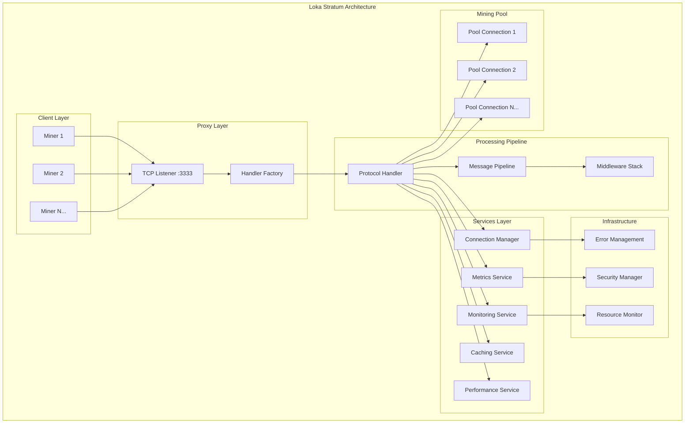
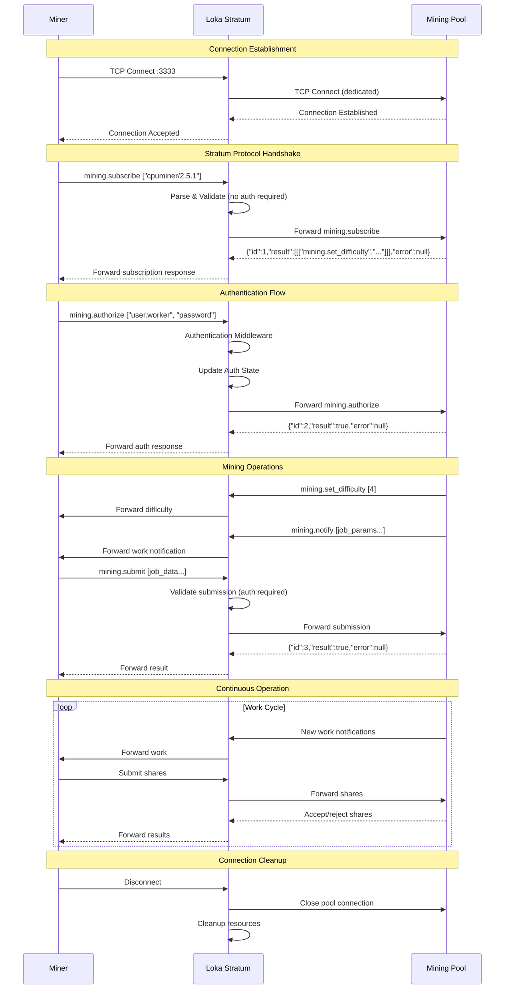
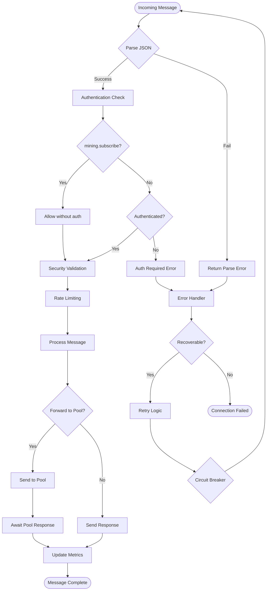
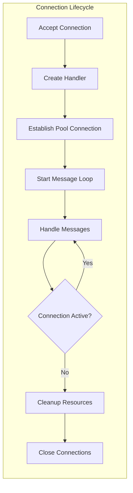
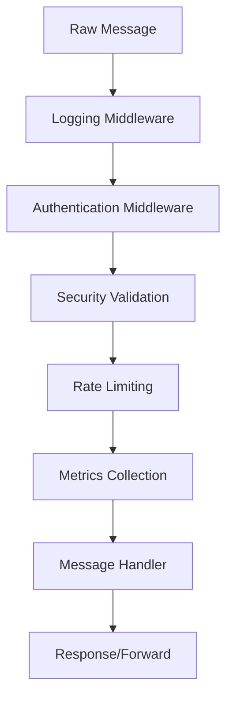
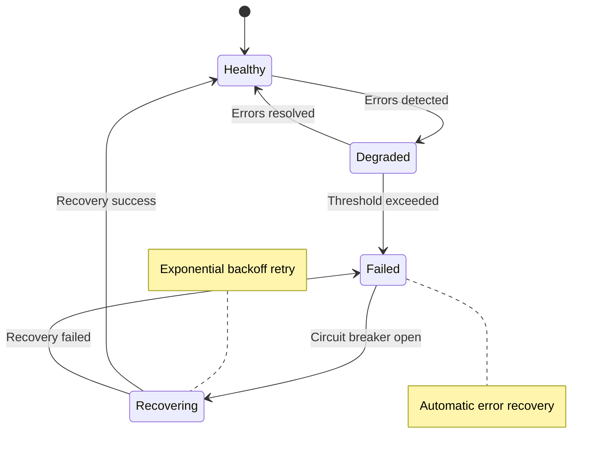
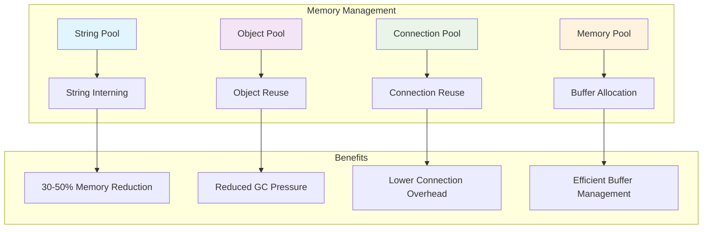
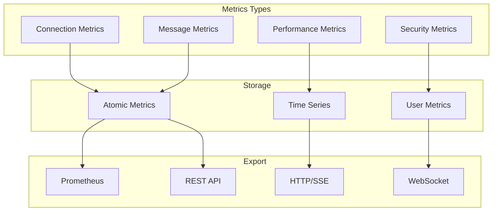
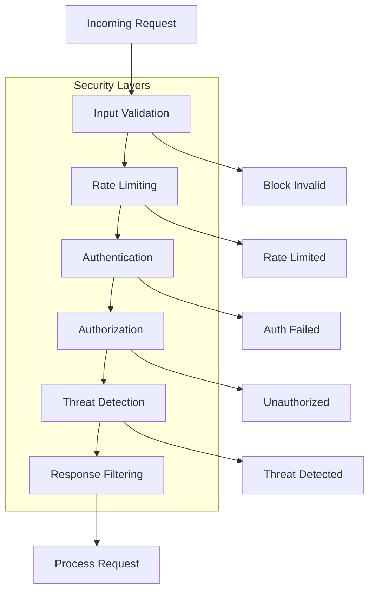

# Loka Stratum - Enterprise Bitcoin Mining Proxy

[](https://www.rust-lang.org)
[](LICENSE)
[](https://github.com/loka/stratum)

**Loka Stratum** is a high-performance, production-ready Bitcoin mining proxy built in Rust. It provides enterprise-grade features including advanced monitoring, security validation, performance optimization, and comprehensive error handling.

## 🚀 Features

### Core Mining Proxy
- **Stratum V1 Protocol Support** - Full Bitcoin mining protocol compliance
- **1:1 Connection Model** - Dedicated pool connection per miner for optimal isolation
- **Multi-Pool Support** - Ready for multiple mining pool configurations
- **Real-time Forwarding** - Low-latency message proxying with async I/O

### Enterprise Features
- **🔒 Advanced Security** - Multi-layer validation, rate limiting, DDoS protection
- **📊 Real-time Monitoring** - Atomic metrics collection with Prometheus export
- **⚡ Performance Optimization** - String interning, connection pooling, caching
- **🛡️ Error Recovery** - Circuit breakers, retry strategies, graceful degradation
- **📈 Resource Management** - Memory pools, CPU optimization, background cleanup

### Architecture
- **Modular Design** - Clean separation of concerns with middleware pipeline
- **Protocol Handler** - Advanced Stratum V1 implementation with middleware
- **Configuration Driven** - Flexible configuration with environment variable support
- **Production Ready** - Comprehensive logging, alerting, and health checks

## 📋 Table of Contents

- [Quick Start](#quick-start)
- [Architecture Overview](#architecture-overview)
- [Configuration](#configuration)
- [Protocol Flow](#protocol-flow)
- [System Components](#system-components)
- [Performance Features](#performance-features)
- [Monitoring & Metrics](#monitoring--metrics)
- [Security Features](#security-features)
- [API Reference](#api-reference)
- [Development](#development)
- [Deployment](#deployment)
- [Troubleshooting](#troubleshooting)

## 🚀 Quick Start

### Prerequisites
- Rust 1.88 
- Tokio async runtime
- Access to Bitcoin mining pool

### Installation
```bash
# Clone the repository
git clone https://github.com/loka/stratum.git
cd stratum

# Build the project
cargo build --release

# Run with default configuration
cargo run --bin loka-stratum
```

### Basic Configuration
```toml
# config.toml
[server]
port = 3333

[pool]
name = "mining_pool"
host = "130.211.20.161"
port = 9200
username = "your_username"
password = "your_password"

[limiter]
connections = 1000
jobs = "10m"
submissions = "2d"
```

## 🏗️ Architecture Overview

### System Architecture



### Component Overview

| Component | Purpose | Status |
|-----------|---------|---------|
| **Protocol Handler** | Modular architecture with middleware pipeline | ✅ Active |
| **Connection Manager** | 1:1 miner-pool connection management | ✅ Active |
| **Metrics Service** | Real-time performance monitoring | ✅ Active |
| **Security Manager** | Multi-layer validation and protection | ✅ Active |
| **Performance Service** | Memory and CPU optimization | ✅ Active |

## ⚙️ Configuration

### Configuration File Structure

```toml
[server]
# Server listening port
port = 3333

[pool]
# Mining pool configuration
name = "default_pool"
host = "pool.example.com"
port = 4444
username = "mining_user"
password = "optional_password"
separator = [".", "_"]  # Worker name separators
extranonce = false

[limiter]
# Connection and resource limits
connections = 1000        # Max concurrent connections
jobs = "10m"             # Job cache duration
submissions = "2d"       # Submission cache duration
```

### Environment Variables

```bash
# Override configuration via environment
export LOKA_SERVER_PORT=3333
export LOKA_POOL_HOST=pool.example.com
export LOKA_POOL_PORT=4444
export LOKA_LOG_LEVEL=info
```

## 🔄 Protocol Flow

### Miner Connection Flow



### Message Processing Pipeline



## 🧩 System Components

### 1. Connection Management



**Features:**
- 1:1 miner-to-pool connection mapping
- Automatic resource cleanup on disconnect
- Connection state tracking and metrics
- Graceful shutdown handling

### 2. Middleware Pipeline



**Middleware Components:**
- **Logging**: Comprehensive request/response logging
- **Authentication**: Stratum protocol authentication
- **Security**: Input validation and threat detection
- **Rate Limiting**: Per-client request throttling
- **Metrics**: Real-time performance data collection

### 3. Error Management



**Error Recovery Features:**
- Circuit breaker patterns for fault tolerance
- Exponential backoff retry strategies
- Graceful error handling and recovery
- Comprehensive error context and logging

## 📊 Performance Features

### Memory Optimization



### CPU Optimization

- **Lock-free Operations**: Atomic metrics with zero contention
- **Fast Hashing**: Optimized hash calculations for mining workloads
- **Efficient Parsing**: Zero-copy string processing where possible
- **Batch Processing**: Bulk operations for reduced per-item overhead

### I/O Optimization

- **Async Architecture**: Non-blocking I/O with Tokio runtime
- **Connection Pooling**: Reuse TCP connections to reduce overhead
- **Background Tasks**: Non-blocking maintenance operations
- **Buffer Management**: Optimized serialization with buffer reuse

## 📈 Monitoring & Metrics

### Metrics Collection



### Available Metrics

#### Connection Metrics
- `total_connections` - Total connections established
- `active_connections` - Currently active connections
- `connection_errors` - Connection establishment failures
- `avg_connection_time` - Average connection establishment time

#### Message Metrics
- `messages_received` - Total messages received from miners
- `messages_sent` - Total messages sent to miners
- `protocol_errors` - Protocol parsing/validation errors
- `auth_success_rate` - Authentication success percentage

#### Performance Metrics
- `cpu_usage_percent` - Current CPU utilization
- `memory_usage_bytes` - Current memory usage
- `response_time_ms` - Average response time
- `pool_latency_ms` - Average pool connection latency

#### Security Metrics
- `security_violations` - Security rule violations
- `rate_limit_hits` - Rate limiting activations
- `blocked_ips` - Number of blocked IP addresses

### Real-time Monitoring

```bash
# HTTP metrics endpoint
curl http://localhost:3333/metrics

# WebSocket real-time feed
wscat -c ws://localhost:3333/metrics/stream

# Server-sent events
curl -N http://localhost:3333/metrics/events
```

## 🔒 Security Features

### Multi-layer Security Architecture



### Security Features

#### Input Validation
- JSON schema validation
- Parameter type checking
- Size and format limits
- Injection attack prevention

#### Rate Limiting
- Per-client message rate limits
- Configurable time windows
- Automatic IP blocking for violations
- Whitelist/blacklist support

#### DDoS Protection
- Connection limits per IP
- Traffic pattern analysis
- Automatic mitigation responses
- Circuit breaker activation

#### Threat Detection
- Malformed request detection
- Suspicious pattern identification
- Real-time violation logging
- Automated response triggers

## 🔧 API Reference

### Configuration API

```rust
// Server configuration
pub struct ServerConfig {
    pub port: u16,
    pub use_protocol_handler: bool,
}

// Pool configuration  
pub struct PoolConfig {
    pub name: String,
    pub host: Ipv4Addr,
    pub port: u16,
    pub username: String,
    pub password: Option<String>,
}

// Limiter configuration
pub struct LimiterConfig {
    pub connections: usize,
    pub jobs: Duration,
    pub submissions: Duration,
}
```

### Metrics API

```rust
// Get current metrics snapshot
GET /metrics
Content-Type: application/json

{
  "connections": {
    "total": 1500,
    "active": 234,
    "errors": 12
  },
  "messages": {
    "received": 45672,
    "sent": 45651,
    "protocol_errors": 5
  },
  "performance": {
    "avg_response_time": 12.5,
    "cpu_usage": 15.2,
    "memory_usage": 128456
  }
}
```

### Health Check API

```rust
// Health check endpoint
GET /health
Content-Type: application/json

{
  "status": "healthy",
  "uptime": "2d 4h 23m",
  "version": "2.0.0",
  "connections": {
    "active": 234,
    "max": 1000
  },
  "services": {
    "pool_connection": "healthy",
    "metrics": "healthy",
    "monitoring": "healthy"
  }
}
```

## 🛠️ Development

### Building from Source

```bash
# Clone repository
git clone https://github.com/loka/stratum.git
cd stratum

# Install dependencies
cargo fetch

# Run tests
cargo test

# Build debug version
cargo build

# Build release version
cargo build --release

# Run with logging
RUST_LOG=debug cargo run --bin loka-stratum
```

### Development Environment

```bash
# Install development tools
cargo install cargo-watch
cargo install cargo-audit
cargo install cargo-tarpaulin

# Auto-rebuild on changes
cargo watch -x "run --bin loka-stratum"

# Security audit
cargo audit

# Code coverage
cargo tarpaulin --out html
```

### Project Structure

```
src/
├── config/           # Configuration management
├── error/           # Error handling and recovery
├── network/         # Network layer components
├── protocol/        # Stratum protocol implementation
├── services/        # Core services (metrics, monitoring)
├── storage/         # Data persistence and caching
├── utils/           # Utility functions and helpers
├── handler.rs       # Legacy connection handler
├── handler_factory.rs # Handler creation and management
├── listener.rs      # TCP listener and connection acceptance
├── lib.rs          # Library exports
└── main.rs         # Application entry point

tests/
├── integration/     # Integration tests
└── unit/           # Unit tests
```

### Adding Custom Middleware

```rust
use crate::protocol::traits::Middleware;
use crate::protocol::pipeline::MessageContext;
use crate::error::Result;

#[derive(Debug)]
pub struct CustomMiddleware {
    // Your middleware state
}

#[async_trait::async_trait]
impl Middleware for CustomMiddleware {
    async fn process(&self, context: MessageContext) -> Result<MessageContext> {
        // Your middleware logic here
        Ok(context)
    }
}

// Register in pipeline
let pipeline = MessagePipelineBuilder::new()
    .with_authentication()
    .with_security()
    .add_middleware(CustomMiddleware::new())
    .build();
```

## 🚀 Deployment

### Docker Deployment

```dockerfile
FROM rust:1.70-slim as builder

WORKDIR /app
COPY . .
RUN cargo build --release

FROM debian:bookworm-slim
RUN apt-get update && apt-get install -y ca-certificates
COPY --from=builder /app/target/release/loka-stratum /usr/local/bin/

EXPOSE 3333
CMD ["loka-stratum"]
```

```bash
# Build and run
docker build -t loka-stratum .
docker run -p 3333:3333 -v ./config.toml:/etc/loka-stratum/config.toml loka-stratum
```

### Kubernetes Deployment

```yaml
apiVersion: apps/v1
kind: Deployment
metadata:
  name: loka-stratum
spec:
  replicas: 3
  selector:
    matchLabels:
      app: loka-stratum
  template:
    metadata:
      labels:
        app: loka-stratum
    spec:
      containers:
      - name: loka-stratum
        image: loka-stratum:latest
        ports:
        - containerPort: 3333
        env:
        - name: LOKA_POOL_HOST
          value: "mining-pool.example.com"
        - name: LOKA_POOL_PORT
          value: "4444"
        resources:
          requests:
            cpu: 100m
            memory: 128Mi
          limits:
            cpu: 500m
            memory: 512Mi
---
apiVersion: v1
kind: Service
metadata:
  name: loka-stratum-service
spec:
  selector:
    app: loka-stratum
  ports:
  - port: 3333
    targetPort: 3333
  type: LoadBalancer
```

### Production Configuration

```toml
[server]
port = 3333

[pool]
name = "production_pool"
host = "pool.example.com"
port = 4444
username = "production_user"
password = "secure_password"

[limiter]
connections = 5000
jobs = "15m"
submissions = "7d"

[security]
enable_rate_limiting = true
max_requests_per_minute = 300
enable_ddos_protection = true
blocked_ip_ttl = "1h"

[metrics]
enable_prometheus = true
prometheus_port = 9090
collection_interval = "30s"

[logging]
level = "info"
format = "json"
enable_file_logging = true
log_file = "/var/log/loka-stratum/app.log"
```

### Monitoring Setup

```yaml
# Prometheus configuration
global:
  scrape_interval: 15s

scrape_configs:
  - job_name: 'loka-stratum'
    static_configs:
      - targets: ['loka-stratum:9090']
    scrape_interval: 5s
    metrics_path: /metrics

# Grafana dashboard
{
  "dashboard": {
    "title": "Loka Stratum Monitoring",
    "panels": [
      {
        "title": "Active Connections",
        "type": "graph",
        "targets": [
          {
            "expr": "loka_stratum_active_connections",
            "legendFormat": "Active Connections"
          }
        ]
      }
    ]
  }
}
```

## 🔧 Troubleshooting

### Common Issues

#### 1. Connection Refused
```bash
# Check if port is available
netstat -ln | grep 3333

# Check firewall settings
sudo ufw status

# Verify configuration
loka-stratum --config config.toml --validate
```

#### 2. High Memory Usage
```bash
# Monitor memory usage
RUST_LOG=debug loka-stratum | grep memory

# Enable memory profiling
export LOKA_ENABLE_MEMORY_PROFILING=true
```

#### 3. Pool Connection Issues
```bash
# Test pool connectivity
telnet pool.example.com 4444

# Check pool credentials
loka-stratum --test-pool-connection
```

### Debug Logging

```bash
# Enable detailed logging
export RUST_LOG=loka_stratum=debug

# Log specific components
export RUST_LOG=loka_stratum::protocol=trace,loka_stratum::network=debug

# Save logs to file
loka-stratum 2>&1 | tee loka-stratum.log
```

### Performance Tuning

```toml
[performance]
# Connection pool settings
connection_pool_size = 100
connection_timeout = "30s"

# Memory optimization
enable_string_interning = true
buffer_pool_size = 1000

# CPU optimization  
worker_threads = 4
blocking_threads = 4
```

### Health Monitoring

```bash
# Check system health
curl http://localhost:3333/health

# Monitor metrics
curl http://localhost:3333/metrics | jq

# Real-time monitoring
watch -n 1 'curl -s http://localhost:3333/health | jq .connections'
```

## 📜 License

This project is licensed under the MIT License - see the [LICENSE](LICENSE) file for details.

## 🤝 Contributing

1. Fork the repository
2. Create your feature branch (`git checkout -b feature/amazing-feature`)
3. Commit your changes (`git commit -m 'Add amazing feature'`)
4. Push to the branch (`git push origin feature/amazing-feature`)
5. Open a Pull Request

## 📞 Support

- **Documentation**: [https://docs.loka-stratum.org](https://docs.loka-stratum.org)
- **Issues**: [GitHub Issues](https://github.com/loka/stratum/issues)
- **Discord**: [Community Chat](https://discord.gg/loka-stratum)
- **Email**: support@loka-stratum.org

## 🙏 Acknowledgments

- Bitcoin Core developers for the Stratum protocol specification
- Tokio team for the excellent async runtime
- Rust community for the amazing ecosystem
- Mining community for feedback and testing

---

**Built with ❤️ in Rust** | **Enterprise-Grade Bitcoin Mining Infrastructure**